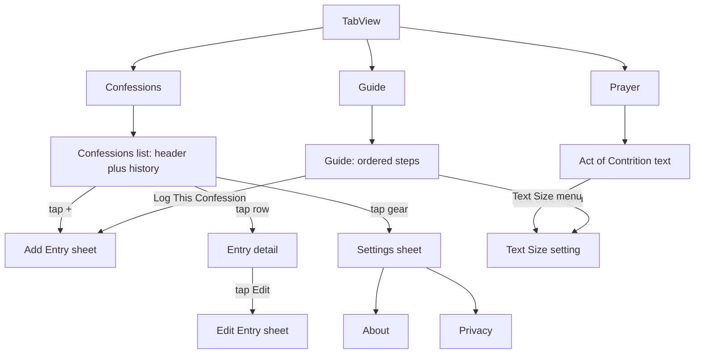

# Confession Tracker: Engineering Specification

| Field | Value |
| --- | --- |
| Product | Confession Tracker |
| Platform | iOS 17.0 and later, iPhone only (iPad runs the iPhone app in compatibility mode; see 3.1) |
| Version covered | 1.0 |
| Document status | Ready for implementation |
| Last updated | 2026-09-22 |

This document is the single source of truth for building version 1.0 of Confession Tracker. It is written so that an engineer or an automated coding agent can implement the app from this document alone. Every requirement is expressed as observable behaviour, a data contract, or an acceptance criterion. Where a requirement is a recommendation rather than a hard rule it is marked **SHOULD**; everything else is **MUST**.

Section numbers are stable. When assigning work, reference sections by number (for example "implement 5.2 Add/Edit Entry sheet").

---

## Table of contents

1. Overview
2. Product principles
3. Platform and technical requirements
4. Information architecture and navigation
5. Feature specifications
   - 5.1 Confessions tab
   - 5.2 Add/Edit Entry sheet
   - 5.3 Entry detail
   - 5.4 Prayer tab (Act of Contrition)
   - 5.5 Text Size control
   - 5.6 Guide tab
   - 5.7 Settings
   - 5.8 First launch
6. Data model and persistence
7. Design system
8. Copy deck
9. Accessibility
10. Privacy and security
11. Content and licensing
12. Project structure and engineering conventions
13. Testing strategy
14. Build, signing and App Store submission
15. Milestones
16. Future considerations
- Appendix A: Act of Contrition text
- Appendix B: Rite of confession walkthrough script
- Appendix C: Bundled content JSON schema and sample
- Appendix D: Acceptance test matrix
- Appendix E: Glossary

---

## 1. Overview

### 1.1 Summary

Confession Tracker is a free iPhone app for Catholics that does three things:

1. Lets the user record each time they receive the Sacrament of Penance (confession), capturing the date, the time, and optionally the penance the priest assigned.
2. Shows the user when they last went and their full history.
3. Provides reference text for the sacrament: the traditional Act of Contrition, and a step-by-step guide to what happens and what to say in the confessional.

The app is deliberately small. It has no accounts, no server, no analytics, no advertising, no purchases, no sync, and no social features. Data lives only on the device (and in the user's own device backups, if they have them turned on).

### 1.2 Goals

- G1. Logging a confession takes no more than two taps from a cold launch when the confession happened "just now".
- G2. The user can always see, at a glance, when they last went to confession.
- G3. The user can read the Act of Contrition and the confession script comfortably in a dim confessional, one-handed, at any Dynamic Type size.
- G4. The app works fully offline and never requires an account.
- G5. The app is indistinguishable from a first-party Apple utility in look and feel.

### 1.3 Non-goals for version 1.0

The following are explicitly out of scope. They are listed so implementers do not add them speculatively. Rationale and possible designs are in Section 16.

- Examination of conscience (any UI where the user enters or checks off sins).
- Reminders or notifications of any kind.
- Home Screen or Lock Screen widgets.
- Statistics, streaks, heatmaps, or charts.
- Liturgical calendar awareness.
- Penance completion tracking.
- Parish finder, maps, or confession schedules.
- Biometric or passcode app lock.
- iCloud sync or any other cross-device sync.
- Data export or import.
- Prayers other than the traditional Act of Contrition (other Act of Contrition forms, prayers before or after confession, psalms).
- Localisation beyond English (but strings MUST be externalised; see Section 8).
- A native iPad app, macOS, watchOS, visionOS. iPad users get the iPhone app in compatibility mode.
- Any monetisation.

### 1.4 Target users

- Practising Catholics who go to confession regularly and want a private, simple record.
- Catholics returning to the sacrament after a long absence who are unsure of the words and sequence.
- Converts and catechumens preparing for first confession.

The app assumes the user already knows what confession is. It does not catechise, and it does not evaluate or comment on the user's frequency of confession.

### 1.5 Success criteria for 1.0

- Passes the acceptance test matrix in Appendix D with zero failures.
- Zero third-party dependencies.
- App Store privacy label is "Data Not Collected".
- Accessibility audit (Section 9) passes with VoiceOver and at Dynamic Type AX5.
- Cold launch to interactive Confessions tab in under 1 second on iPhone 11 or newer.

---

## 2. Product principles

These principles resolve ambiguity. When two reasonable implementations exist, choose the one that better satisfies the earlier principle.

**P1. Private by construction.** The app never sends data anywhere. The only copies of the user's entries outside the app are in the user's own device backups (iCloud Backup or a computer backup), which the app does not control. No network calls of any kind. No SDKs. No logging of user content, even locally in debug builds.

**P2. Neutral voice.** Copy is factual and plain. The app never praises, scolds, encourages, or interprets. It reports dates and shows text. Examples: "Last confession: 14 March 2026" is correct; "It has been a while!" or "Great job!" are not. Full copy is in Section 8; do not invent strings.

**P3. System look.** Use standard SwiftUI components with their default styling, including the Liquid Glass appearance they adopt when built with the iOS 26 SDK. Do not build custom controls where a system control exists. One accent colour (plus the supporting colours in 7.2), SF Symbols only, system fonts only, automatic light and dark appearance.

**P4. Offline only.** Every feature works with no network, because no feature uses the network.

**P5. Small surface, fully finished.** Every screen handles empty, populated, editing, loading (where applicable) and error states. Every interactive element has an accessibility label. Nothing ships half-done behind a flag.

**P6. Reversible where possible, confirmed where not.** Edits are undoable by editing again. Deletion is permanent and therefore always confirmed.

---

## 3. Platform and technical requirements

### 3.1 Targets and toolchain

| Item | Requirement |
| --- | --- |
| Minimum iOS | 17.0 |
| Devices | iPhone only (`TARGETED_DEVICE_FAMILY = 1`). On iPad the system runs the iPhone app in compatibility mode; no iPad layouts, screenshots, or tests are produced. |
| Orientation | Portrait only. |
| Language | Swift 6 language mode (strict concurrency is enforced by the compiler). Default actor isolation: `MainActor`. |
| UI framework | SwiftUI exclusively. No UIKit views except where SwiftUI has no equivalent (none expected in 1.0). |
| Persistence | SwiftData, local store only. |
| Sync | None. The app does not use CloudKit, iCloud, or any other sync mechanism. |
| IDE / build | Xcode 26 or later with the iOS 26 SDK or later; use the current Xcode release at implementation time. Since 28 April 2026, App Store Connect rejects uploads built with older SDKs. Building with the iOS 26 SDK makes system components adopt Liquid Glass; do not opt out (do not set `UIDesignRequiresCompatibility`). Project MUST build from a clean checkout with `xcodebuild` and no manual steps other than selecting a signing team. |
| Dependencies | None. No Swift Package Manager dependencies, no CocoaPods, no binaries. |
| Bundle identifier | `com.<organisation>.confessiontracker` (replace `<organisation>`). |
| App category | Lifestyle (primary), Reference (secondary) |

### 3.2 Capabilities and entitlements

None. The app target has no capabilities and no entitlements file. Specifically: no iCloud, no Background Modes, no Push Notifications, no App Groups, no Keychain Sharing, no Sign in with Apple, no Location. The app never requests any permission.

### 3.3 Info.plist keys

- `NSUserActivityTypes`: not set.
- `UISupportedInterfaceOrientations`: Portrait only.
- `CFBundleDisplayName`: `Confession` (the Home Screen label; "Confession Tracker" would truncate). The App Store name stays "Confession Tracker".
- `ITSAppUsesNonExemptEncryption`: `NO`.
- No usage-description keys (`NS*UsageDescription`) because no protected resources are accessed.
- `UILaunchScreen`: system launch screen with `UIColorName` = `LaunchBackground` (asset-catalog colour, 7.2); no storyboard.

### 3.4 Device and environment behaviour

- The app MUST behave identically whether or not the device is signed in to iCloud; it does not check.
- The app MUST respect Low Power Mode by not doing any extra work; there is no periodic work in 1.0 so this is satisfied by default.
- Time zone and calendar changes MUST be handled: all "days ago" computations use `Calendar.autoupdatingCurrent` and `TimeZone.autoupdatingCurrent` at render time, never cached. Every screen that shows a relative interval recomputes it when the scene becomes active and on `UIApplication.significantTimeChangeNotification` (posted at midnight and on time zone or clock changes), so "Today" is never stale while the app is open.
- Entries don't record the time zone they were made in (deliberately: a stored time zone reveals the user's approximate location, and 5.2.3 promises only date, time and penance are stored). Dates are always displayed in the device's current time zone. If the user travels, an entry's displayed date and time shift with the local clock; for example, a Saturday 7:30 PM confession in New York displays as Sunday 1:30 AM in Rome. This is accepted behaviour for 1.0.
- Locale: dates and times are formatted with the system formatters honouring the user's region settings. Do not hard-code date formats.

### 3.5 Performance budgets

| Metric | Budget |
| --- | --- |
| Cold launch to first interactive frame | Less than 1.0 s on iPhone 11 |
| History list scroll | 60 fps with 1,000 entries |
| Entry save | UI reflects saved entry in less than 100 ms |
| Memory | Under 50 MB resident with 1,000 entries |
| App size | Under 10 MB download |

---

## 4. Information architecture and navigation

### 4.1 Top-level structure

The root view is a `TabView` with three tabs. Settings is not a tab; it is a sheet presented from the Confessions tab toolbar.



### 4.2 Navigation rules

- Each tab owns its own `NavigationStack`. Switching tabs preserves each stack.
- Sheets (`Add Entry`, `Edit Entry`, `Settings`) are presented with `.sheet` and a `NavigationStack` inside so they have a title bar with Cancel/Save or Done.
- Sheets that contain unsaved changes MUST use `.interactiveDismissDisabled(true)` when the form is dirty, and present a confirmation dialog on Cancel if dirty (see 5.2.6).
- The app has no deep links, no URL scheme, no universal links, no Handoff, and no Spotlight indexing in 1.0.
- State restoration: on relaunch the app opens on the Confessions tab with an empty navigation stack. No state restoration is implemented.

### 4.3 Tab bar

| Position | Title | SF Symbol | Accessibility label |
| --- | --- | --- | --- |
| 1 | Confessions | `calendar` | "Confessions" |
| 2 | Prayer | `book.closed` | "Act of Contrition" |
| 3 | Guide | `list.number` | "Guide" |

Tab titles use string keys `tab.confessions`, `tab.prayer`, `tab.guide`; the Prayer tab's accessibility label uses `a11y.tab.prayer` (Section 8).

---

## 5. Feature specifications

Each feature is specified with: purpose, user stories, layout, states, behaviour, and acceptance criteria. Acceptance criteria are numbered `AC-<section>-<n>` and collected in Appendix D.

### 5.1 Confessions tab

#### 5.1.1 Purpose

Show when the user last went to confession, let them log a new confession quickly, and browse their history.

#### 5.1.2 User stories

- As a user who has just left the confessional, I want to log the confession with as few taps as possible.
- As a user preparing for confession, I want to see the date of my last confession so I can tell the priest how long it has been.
- As a user, I want to browse and correct my past entries.

#### 5.1.3 Layout

A `NavigationStack` containing a `List` with `.insetGrouped` style. Navigation title: "Confessions" (`confessions.title`), large title display mode.

Toolbar:

- Leading: gear button (`gearshape`), accessibility label "Settings" (`a11y.settings.button`). Presents the Settings sheet.
- Trailing: add button (`plus`), accessibility label "New Confession" (`a11y.add.button`), matching the title of the sheet it opens. Presents the Add Entry sheet.

List content, top to bottom:

**Section 1: Summary header (no section title)**

One row, not tappable, containing:

- Line 1, `.headline` style: "Last confession" (`summary.lastConfession`).
- Line 2, `.title2` style, bold: the date of the most recent entry formatted with `Date.FormatStyle(date: .long, time: .omitted)`. Example: "14 March 2026".
- Line 3, `.subheadline` style, secondary colour: the relative interval per the rules in 5.1.5. Example: "12 days ago".

When there are no entries the row instead shows:

- Line 1, `.headline`: "No confessions logged" (`summary.empty.title`).
- Line 2, `.subheadline`, secondary: "Use Log Confession Now to record a confession." (`summary.empty.body`).

Accessibility: the row is one element. Populated label: "Last confession, {date}, {interval}" (`a11y.summary`). Empty label: the two empty-state lines joined.

**Section 2: Primary action**

One row containing a full-width `Button` with `.borderedProminent` style and `.controlSize(.large)`, label "Log Confession Now" (`action.logNow`). Tapping it presents the Add Entry sheet (5.2) in Add mode, with the date set to the current minute and penance empty. Nothing is written to the store until the user taps Save, so a mistaken tap is undone by Cancel or swipe-down. This satisfies Goal G1: tap 1 opens the prefilled sheet, tap 2 (Save) records the confession. The `+` toolbar button opens the same sheet; this button is the prominent, labelled path to it.

This section appears in both the empty and populated states.

**Sections 3..n: History**

One section per calendar year that contains at least one entry, newest year first. Section header is the four-digit year (for example "2026"). Within a section rows are sorted by `date` descending.

Each row is a `NavigationLink(value: EntryRoute(id: entry.id))` to Entry Detail (5.3), following the model lifetime rule in 12.2, and shows up to three lines, always stacked vertically and leading-aligned (never side by side, so nothing competes for width at any text size or screen width):

- Line 1, `.body`: the entry date formatted `Date.FormatStyle(date: .abbreviated, time: .shortened)`. Example: "14 Mar 2026, 4:30 PM". Wraps if needed; never truncated.
- Line 2, `.subheadline`, secondary: the interval since the previous (older) entry, per 5.1.6. Example: "3 weeks after previous". Omitted for the oldest entry. Wraps if needed; never truncated.
- Line 3, only if `penance` is non-empty, `.footnote`, secondary, single line truncated with tail: the penance text. This is the only truncated text in the app.

Row accessibility label, built from these keys:
- Base: `a11y.historyRow` "{dateTime}" (full date and time).
- With an interval: `a11y.historyRow.withInterval` "{dateTime}, {interval}".
- With penance: append ", " and `a11y.historyRow.penance` "Penance: {penance}".

#### 5.1.4 States

| State | Condition | Display |
| --- | --- | --- |
| Empty | Zero entries | Summary shows empty copy; primary action shown; no history sections |
| Populated | One or more entries | As described |
| Loading | SwiftData is opening the store on first launch | Show the list skeleton immediately with the summary row blank; SwiftData loads are synchronous on main context so this state is expected to be sub-frame and needs no spinner |
| Error | Store failed to open | See 6.5 Failure handling. The Confessions tab shows the store error; the Prayer and Guide tabs keep working |

#### 5.1.5 Interval bucket (shared by every interval in the app)

All three interval texts (5.1.5 summary, 5.1.6 history rows, 5.6.3 Guide) are rendered from one computed value, so their thresholds can't drift apart:

```swift
enum IntervalBucket: Equatable {
    case sameDay          // 0 calendar days
    case days(Int)        // 1...13
    case weeks(Int)       // 2...8
    case months(Int)      // 2...23
    case years(Int)       // 2...
}
```

`IntervalFormatter.bucket(from earlier: Date, to later: Date, calendar: Calendar) -> IntervalBucket` is a pure function:

1. `a = calendar.startOfDay(for: earlier)`, `b = calendar.startOfDay(for: later)`.
2. `dayCount = calendar.dateComponents([.day], from: a, to: b).day`. If `dayCount <= 0` (including an entry in the future after a clock change), return `.sameDay`.
3. `1...13` → `.days(dayCount)`.
4. `14...59` → `.weeks(dayCount / 7)` (integer division; 2 to 8).
5. `60` or more: `monthCount = calendar.dateComponents([.month], from: a, to: b).month`. If `monthCount < 24`, return `.months(max(monthCount, 2))`. Otherwise return `.years(monthCount / 12)`.

Both day and month counts are measured between start-of-day values, so the time of day never changes the result. Years are derived from the same month count, so the output never decreases as the interval grows; for example 729 days reads "23 months" and 730 days reads "23 months" or "2 years", never "1 year". A 1-year bucket cannot occur.

The summary text, `IntervalFormatter.sinceLast(_ last: Date, now: Date, calendar: Calendar) -> String`, renders the bucket from `last` to `now`:

| Bucket | Text | Key |
| --- | --- | --- |
| `.sameDay` | Today | `interval.today` |
| `.days(1)` | Yesterday | `interval.yesterday` |
| `.days(n)` | {n} days ago | `interval.daysAgo` |
| `.weeks(n)` | {n} weeks ago | `interval.weeksAgo` |
| `.months(n)` | {n} months ago | `interval.monthsAgo` |
| `.years(n)` | {n} years ago | `interval.yearsAgo` |

Unit tests are required (13.2).

#### 5.1.6 Interval formatting: "after previous"

`IntervalFormatter.afterPrevious(current: Date, previous: Date, calendar: Calendar) -> String` renders the bucket from `previous` to `current`:

| Bucket | Text | Key |
| --- | --- | --- |
| `.sameDay` | Same day as previous | `interval.sameDayAsPrevious` |
| `.days(n)` | {n} days after previous (plural "one" variant: "1 day after previous") | `interval.daysAfterPrevious` |
| `.weeks(n)` | {n} weeks after previous | `interval.weeksAfterPrevious` |
| `.months(n)` | {n} months after previous | `interval.monthsAfterPrevious` |
| `.years(n)` | {n} years after previous | `interval.yearsAfterPrevious` |

The "previous" entry is the next older entry in the full date-sorted list, across year sections: the oldest entry of 2026 is compared with the newest entry of 2025.

#### 5.1.7 Behaviour

- Swipe to delete on a history row reveals a red "Delete" action. Implement it with `.swipeActions(edge: .trailing, allowsFullSwipe: false)` containing a `Button` with no role, label `Label("Delete", systemImage: "trash")` (`common.delete`), and `.tint(.red)`. Do not give it `role: .destructive`: a destructive swipe button makes SwiftUI remove the row before the confirmation appears, so Cancel would make the row vanish and reappear. This is the one sanctioned exception to 7.1's "destructive actions use `role: .destructive`" rule; the destructive role belongs on the dialog's Delete button instead. Tapping it presents a confirmation dialog (`.confirmationDialog`) with title "Delete this confession?" (`delete.confirm.title`), destructive button "Delete" (`delete.confirm.action`), and Cancel. The dialog's state holds the entry's `id`, not the entry. Confirmed deletion calls `EntryStore.delete(id:)`; the list animates the removal and the summary header updates.
- The list uses `@Query` sorted by `date` descending. Year grouping is computed in the view model from the query result; do not run one query per year.
- Pull-to-refresh is NOT provided; there is no remote data to refresh.
- The summary interval and history row intervals depend on `now`. Hold `now` in a state variable and update it whenever `scenePhase` becomes `.active` and on `UIApplication.significantTimeChangeNotification` (3.4).

#### 5.1.8 Acceptance criteria

- AC-5.1-1: With zero entries, the summary shows the empty copy and no year sections exist.
- AC-5.1-2: Tapping "Log Confession Now" presents the New Confession sheet with the date set to the current minute and creates no entry. Tapping Save then creates exactly one entry with that date; tapping Cancel instead leaves the number of entries unchanged.
- AC-5.1-3: Entries are grouped by year with newest year first and newest entry first within a year.
- AC-5.1-4: The summary interval text matches the rules in 5.1.5 for the boundary values 0, 1, 2, 13, 14, 59, 60 days and 23, 24 months, and updates at midnight while the app stays open.
- AC-5.1-5: Swipe-to-delete followed by Cancel leaves the entry in place; followed by Delete removes it.
- AC-5.1-6: With 1,000 entries the list scrolls at 60 fps on an iPhone 11 (Instruments, no dropped-frame warnings).
- AC-5.1-7: Toolbar buttons have the accessibility labels "Settings" and "New Confession".
- AC-5.1-8: History rows show date, interval and penance preview stacked, with the date and interval fully visible (no truncation) at default text size on a 375-point-wide device (iPhone SE).

### 5.2 Add/Edit Entry sheet

#### 5.2.1 Purpose

Create or modify a confession entry.

#### 5.2.2 Presentation

A `.sheet` containing a `NavigationStack` with a `Form`. Presentation detents: `.large` only. The sheet is used in two modes:

- **Add mode**: presented from the `+` toolbar button, "Log Confession Now" (5.1.3), or "Log This Confession" (5.6.2). All three open an identical sheet. Title "New Confession" (`entry.add.title`). Buttons: Cancel (leading), Save (trailing). Nothing is written to the store until Save; Cancel, swipe-down, or leaving the app without saving never leaves an entry behind.
- **Edit mode**: presented only from Entry Detail (5.3). Title "Edit Confession" (`entry.edit.title`). Buttons: Cancel (leading), Done (trailing). The entry already exists; changes are saved on Done and discarded on Cancel.

Implementation note: in Edit mode the sheet is given the entry's `id` (12.2 model lifetime rule). It copies the entry's fields into local `@State` when it appears and writes them back through `EntryStore.update(id:date:penance:)` on Done. Do not bind the form directly to the SwiftData object, otherwise Cancel cannot discard. If the entry no longer exists when the sheet appears or when Done is tapped, the sheet dismisses without writing and without an error.

#### 5.2.3 Form content

**Section: Date and time** (header `entry.section.dateTime`, "Date and Time")

- `DatePicker` with `displayedComponents: [.date, .hourAndMinute]`, label "Date" (`entry.field.date`), style `.compact`. Range: 1 January 1900 00:00 local time through `max(Date(), originalDate)`, evaluated at sheet presentation, where `originalDate` is the entry's stored date in Edit mode and `Date()` in Add mode. (An entry already in the future because of a clock change can therefore be re-saved unchanged.) Default value in Add mode: `Date()` rounded down to the nearest minute.
- Same-day notice (Add mode only): when the selected date falls on a calendar day that already has an entry, the section footer reads "An entry already exists for this day." (`entry.sameDay.notice`). It is informational only: Save stays enabled, and the notice updates as the date changes.

**Section: Penance** (header `entry.section.penance`, "Penance")

- `TextField` with `axis: .vertical`, `lineLimit(3...8)`, placeholder "Penance received (optional)" (`entry.field.penance.placeholder`). Bound to a `String`. Autocapitalisation: sentences. Autocorrection: on. Limit: 2,000 characters, counted as Swift `Character`s (user-perceived characters, so an emoji counts as one). Input that would exceed the limit, whether typed or pasted, is cut to the first 2,000 characters as it is entered, so the user always sees exactly what will be saved. When the text is within 200 characters of the limit, the section footer adds a counter line "{n} of 2,000 characters" (`entry.penance.counter`).
- Section footer (`entry.section.penance.footer`): "Only the date, time, and penance are stored. Nothing else about the confession is recorded."

#### 5.2.4 Validation

- Date MUST NOT be later than `Date()` at the moment of Save/Done, unless it is unchanged from the entry's stored date in Edit mode (see the range in 5.2.3). The `DatePicker` range prevents this in normal use. If it is nonetheless violated (clock changed while the sheet was open), Save/Done does not save and shows an alert: title "Can't Save" (`entry.error.futureDate.title`), message "The date can't be in the future." (`entry.error.futureDate.message`), OK.
- Penance is trimmed of leading and trailing whitespace and newlines. If the trimmed result is empty, store `nil`.
- The 2,000-character limit is enforced in the field (5.2.3), not at save time. `EntryStore` also rejects longer values as a programmer error (assertion in debug; truncates in release), because the field should make that impossible.

#### 5.2.5 Save behaviour

- Add mode: call `EntryStore.create(date:penance:)`, which inserts a new `ConfessionEntry` with `createdAt = Date()` and `updatedAt = createdAt`, and saves. Dismiss.
- Edit mode: call `EntryStore.update(id:date:penance:)`, which fetches the entry by `id`, assigns the new `date` and `penance`, sets `updatedAt = Date()`, and saves. Dismiss.
- Save MUST be synchronous on the main context so the list updates in the same frame as the dismissal animation begins.
- On save, trigger `UINotificationFeedbackGenerator().notificationOccurred(.success)` only if the user has not enabled Reduce Motion (haptics are permitted with Reduce Motion, but we keep it simple and tie the two together; see 7.6).

#### 5.2.6 Cancel behaviour

- If the form is not dirty (no field differs from its initial value), Cancel dismisses immediately.
- If dirty, Cancel presents a confirmation dialog: title "Discard changes?" (`entry.discard.title`), destructive "Discard Changes" (`entry.discard.action`), Cancel. Swipe-down dismissal is disabled while dirty via `.interactiveDismissDisabled(isDirty)`.
- In Add mode the prefilled date counts as the initial value, so opening the sheet and immediately tapping Cancel dismisses without a dialog and creates nothing.

#### 5.2.7 Acceptance criteria

- AC-5.2-1: In Add mode the date picker defaults to the current date and time (to the minute).
- AC-5.2-2: The date picker cannot select a date later than now or earlier than 1 January 1900.
- AC-5.2-3: Saving with penance "   " (whitespace only) stores `nil`.
- AC-5.2-4: Pasting 2,500 characters into the penance field leaves exactly 2,000 characters visible in the field, shows the counter, and Save stores those 2,000 characters. An emoji counts as one character.
- AC-5.2-5: Cancel on an untouched form dismisses without a dialog; Cancel on a modified form shows the Discard dialog.
- AC-5.2-6: Swipe-down on a modified form does not dismiss the sheet.
- AC-5.2-7: In Edit mode, changing the date and tapping Done updates the entry's position in the list.
- AC-5.2-8: In Add mode, when the selected date falls on a calendar day that already has an entry, the same-day notice is shown; Save still creates the entry. Changing the date to a day with no entry hides the notice.

### 5.3 Entry detail

#### 5.3.1 Purpose

Show one entry in full and give access to Edit and Delete.

#### 5.3.2 Layout

Pushed onto the Confessions `NavigationStack` via `navigationDestination(for: EntryRoute.self)`. The view receives only the route and loads its entry with an `@Query` filtered by `id` (12.2). If the query returns no entry, the view renders nothing and pops itself. Navigation title: the entry date formatted `.long` date only, inline display mode. `List` with `.insetGrouped` style:

**Section: Date and time**

- Row "Date" (`detail.field.date`) with trailing value `Date.FormatStyle(date: .complete, time: .omitted)`. Example: "Saturday, 14 March 2026".
- Row "Time" (`detail.field.time`) with trailing value `Date.FormatStyle(date: .omitted, time: .shortened)`. Example: "4:30 PM".

**Section: Penance**

- If penance is present: one row with the full penance text, `.body`, selectable (`.textSelection(.enabled)`), unlimited lines.
- If absent: one row with "No penance recorded" (`detail.penance.empty`) in secondary colour.

**Section: Actions**

- Row: `Button("Delete Confession", role: .destructive)` (`detail.delete`). Presents the same confirmation dialog as 5.1.7. On confirmation the detail view does not delete the entry itself. Instead:
  1. It records the entry's `id` as the pending deletion in the Confessions tab's navigation state (an `@Observable` object owned by the Confessions list that also holds the `NavigationPath`).
  2. It pops back to the list.
  3. When the list observes that the detail route has left the path, it calls `EntryStore.delete(id:)` for the pending `id` and clears it. The list animates the row's removal.

  If the deletion happens while the pop animation is still running, the detail view's `@Query` simply goes empty; it never reads the deleted object.

Toolbar trailing: "Edit" (`detail.edit`) button presenting the Edit Entry sheet.

#### 5.3.3 Acceptance criteria

- AC-5.3-1: Date and time rows display the entry's values in the user's locale and time zone.
- AC-5.3-2: Long penance text (2,000 characters) is fully visible by scrolling, not truncated.
- AC-5.3-3: Delete with confirmation removes the entry and returns to the list.
- AC-5.3-4: Editing the entry and tapping Done updates the detail screen without popping.
- AC-5.3-5: Opening an entry, deleting it from the detail screen and confirming returns to the list with the entry gone and no crash, 20 times in a row in one UI test run.

### 5.4 Prayer tab (Act of Contrition)

#### 5.4.1 Purpose

Show the traditional Act of Contrition as readable text, one tap from anywhere in the app. It is the only prayer in 1.0; other prayers are deferred (Section 16).

#### 5.4.2 Layout

`NavigationStack`. Navigation title "Act of Contrition" (`prayer.title`), large title. The tab shows the prayer directly; there is no list and no navigation. Content is a `ScrollView` containing a `VStack(alignment: .leading, spacing: 16)`:

- The prayer body from `actOfContrition` in `Content.json` (Appendix A, Appendix C). `.body` font, primary colour, `.textSelection(.enabled)`, line spacing 4 pt, leading-aligned, horizontal padding 20 pt. Each element of `body` is a separate `Text` so paragraph spacing is preserved.
- Below the body, the `source` string in `.footnote`, secondary colour: "Traditional; public domain."
- Bottom padding 40 pt.

Toolbar trailing: the Text Size menu (5.5).

#### 5.4.3 Behaviour

- Text wraps at every Dynamic Type size; no horizontal scrolling.
- The screen stays awake while this tab is visible, because the user reads it in the confessional without touching the phone for minutes. Set `UIApplication.shared.isIdleTimerDisabled = true` when the tab appears while the scene is active. Set it back to `false` when the tab disappears or the scene leaves `.active`. The Guide does the same (5.6.4). No other screen changes the idle timer.
- Nothing else: no audio, sharing, favourites, or alternative forms.

#### 5.4.4 Acceptance criteria

- AC-5.4-1: The tab shows the full traditional Act of Contrition from Appendix A and its source line, with no list or navigation.
- AC-5.4-2: The text is selectable and copyable, and wraps without clipping at `.accessibility5`.
- AC-5.4-3: While the tab is visible the device does not auto-lock. After switching to the Confessions tab or backgrounding the app, auto-lock behaves normally again.

### 5.5 Text Size control

#### 5.5.1 Purpose

Let the user enlarge reading text beyond their system Dynamic Type setting on the two reading screens, where G3 applies.

#### 5.5.2 Control

A toolbar `Menu` with SF Symbol `textformat.size` and accessibility label "Text Size" (`textSize.menu`). It appears in the trailing toolbar of both the Prayer tab (5.4) and the Guide tab (5.6). It contains an inline `Picker` with three options, the current one shown with a checkmark: "Default", "Large", "Extra Large" (`textSize.default`, `textSize.large`, `textSize.extraLarge`).

#### 5.5.3 Behaviour

- Stored as `@AppStorage("textSizeSteps")`, an `Int`: 0, 2 or 4 for Default, Large and Extra Large. There is one shared setting, so changing it in either tab changes both.
- Applied by wrapping the reading content in `.dynamicTypeSize(stepped)`. `stepped` is the environment's `DynamicTypeSize` moved up by that many positions in `DynamicTypeSize.allCases`, clamped at `.accessibility5`. Scaling therefore follows the Dynamic Type curve; the options are steps, not fixed multipliers.
- When the system size is already at or near `.accessibility5`, the steps are clamped and the options have little or no visible effect. They stay enabled; this is expected.
- Applies only to prayer body text and guide line text. Navigation titles, the tab bar and other screens are unaffected.

#### 5.5.4 Acceptance criteria

- AC-5.5-1: Choosing Extra Large in the Guide enlarges both the Guide text and the Prayer tab text, and the choice persists across relaunch.
- AC-5.5-2: The menu shows a checkmark on the current option in both tabs.
- AC-5.5-3: At system size `.accessibility5`, choosing Extra Large doesn't clip or overflow any text.

### 5.6 Guide tab

#### 5.6.1 Purpose

Walk the user through the individual rite of confession from entering to leaving, showing clearly what the penitent says and what the priest says.

#### 5.6.2 Layout

`NavigationStack`. Navigation title "Guide" (`guide.title`), large title. Toolbar trailing: the Text Size menu (5.5). Content is a `List` with `.insetGrouped` style driven by the bundled `guideSteps` array (Appendix C, full text in Appendix B).

**Section: Intro** (no header)

One row with the intro paragraph from `guideIntro` in the content file (Appendix B), `.body`, secondary colour.

**Sections: one per step**, header is "Step {n}: {step title}" (`guide.step.header`).

Within a step section, each row is one `GuideLine`. Row rendering by `speaker`:

| speaker | Rendering |
| --- | --- |
| `penitent` | Leading label "You" (`guide.speaker.you`) in accent colour, `.caption`, bold, then the line text in `.body`, primary colour. |
| `priest` | Leading label "Priest" (`guide.speaker.priest`) in secondary colour, `.caption`, bold, then the line text in `.body`, primary colour, regular (not italic). The label, not dimming, tells the speakers apart. |
| `both` | Leading label "Together" (`guide.speaker.together`), `.caption`, bold, primary; line text `.body`, primary. |
| `note` | No label; line text in `.footnote`, primary colour. |

Speaker values have strict meanings. `penitent`, `priest` and `both` lines contain only words that are actually said, in their customary wording. Anything that describes what happens, including what the priest does or might say in his own words, is a `note`. The renderer never shows "Priest:" in front of a description.

Lines may consist of the token `{blessMe}`. At render time the app replaces it with the `guide.line.blessMe` sentence, whose `{interval}` placeholder is filled with the phrase from 5.6.3. Lines may consist of the token `{actOfContrition}`; at render time the app replaces it with the full body of the traditional Act of Contrition (`actOfContrition` in `Content.json`, the same text as the Prayer tab). It is rendered as one paragraph per body element in `.body` primary colour, with 8 pt spacing between paragraphs. Tokens always occupy the whole `text` value; no other tokens are permitted (Appendix C, C.4).

The last section is **After Confession** (a normal step in the content) followed by one final row containing a `Button` "Log This Confession" (`guide.logNow`), `.borderedProminent`, which behaves exactly like "Log Confession Now" in 5.1.3: it presents the Add Entry sheet prefilled with the current minute and saves nothing until Save. After the sheet dismisses the user stays on the Guide tab.

#### 5.6.3 Interval phrase for "since my last confession"

Function `IntervalFormatter.spokenInterval(_ last: Date?, now: Date, calendar: Calendar) -> String` returns only the phrase that fills `{interval}` in `guide.line.blessMe`. It never returns a full sentence.

- If `last == nil`: return the bracketed placeholder "[time]" (`guide.interval.placeholder`), so the line reads "Bless me, Father, for I have sinned. It has been [time] since my last confession." The Beginning step always includes the note "If this is your first confession, say: This is my first confession." (Appendix B, Step 4).
- Otherwise render `IntervalFormatter.bucket(from: last, to: now, calendar:)` (5.1.5):

| Bucket | Phrase | Key |
| --- | --- | --- |
| `.sameDay` | less than a day | `guide.interval.lessThanDay` |
| `.days(1)` | one day | `guide.interval.oneDay` |
| `.days(n)` | {n} days | `guide.interval.days` |
| `.weeks(n)` | {n} weeks | `guide.interval.weeks` |
| `.months(n)` | {n} months | `guide.interval.months` |
| `.years(n)` | {n} years | `guide.interval.years` |

Example: a last entry 21 days ago gives "3 weeks", and the line reads "Bless me, Father, for I have sinned. It has been 3 weeks since my last confession."

#### 5.6.4 Behaviour

- The Text Size setting (5.5) applies to all line text on this screen.
- Sections are not collapsible in 1.0.
- The `{blessMe}` sentence is recomputed when `scenePhase` becomes `.active`, on `UIApplication.significantTimeChangeNotification`, and whenever the entry set changes (use `@Query` for the most recent entry so the last case is automatic).
- The screen stays awake while the Guide tab is visible, with the same rules as 5.4.3.
- If the store failed to open (6.5), the Guide still works: the sentence uses the "[time]" placeholder and the "Log This Confession" button is hidden.

#### 5.6.5 Acceptance criteria

- AC-5.6-1: Every step in the content file renders in order with the correct header and every line renders with the correct speaker treatment.
- AC-5.6-2: With no entries, the "Bless me, Father" line shows the bracketed placeholder and the first-confession note is visible.
- AC-5.6-3: With a most recent entry 21 days ago, the line reads exactly "Bless me, Father, for I have sinned. It has been 3 weeks since my last confession." ("It has been" appears once).
- AC-5.6-4: The Act of Contrition step shows the full traditional Act of Contrition, identical to the Prayer tab.
- AC-5.6-5: "Log This Confession" presents the New Confession sheet; Save creates an entry that the Confessions tab then shows; Cancel creates none.
- AC-5.6-6: While the Guide tab is visible the device does not auto-lock; auto-lock resumes after leaving the tab or backgrounding the app.

### 5.7 Settings

#### 5.7.1 Presentation

`.sheet` from the Confessions tab gear button. `NavigationStack` with `Form`. Title "Settings" (`settings.title`), inline. Trailing "Done" dismisses. Detent `.large`.

#### 5.7.2 Content

**Section: Data** (`settings.section.data`)

- `Button("Delete All Confessions", role: .destructive)` (`settings.deleteAll`). Presents a confirmation dialog: title "Delete all confessions?" (`settings.deleteAll.confirm1.title`), message "This deletes every entry on this device." (`settings.deleteAll.confirm1.message`), destructive "Delete All" (`settings.deleteAll.confirm1.action`), Cancel. On confirmation, a second alert: title "Are you sure?" (`settings.deleteAll.confirm2.title`), message "This can't be undone." (`settings.deleteAll.confirm2.message`), destructive "Delete All" , Cancel. On second confirmation, call `EntryStore.deleteAll()`. Settings is reachable only from the Confessions list at the root of its stack, so no single-entry view (detail or Edit sheet) is open at that moment. The views that are open (the list and the Guide) read entries through `@Query` and update without reading deleted objects. Footer: "Deleting removes all entries. The prayer and the guide are not affected." (`settings.data.footer`)

**Section: About** (`settings.section.about`)

- Row "Version" (`settings.version`) with trailing value "{CFBundleShortVersionString} ({CFBundleVersion})".
- `NavigationLink("Privacy")` (`settings.privacy`) pushing a `ScrollView` with the privacy statement text from Section 10.5, `.body`, selectable.
- `NavigationLink("Acknowledgements")` (`settings.acknowledgements`) pushing a `ScrollView` listing text sources from Section 11.

#### 5.7.3 Acceptance criteria

- AC-5.7-1: Delete All requires two confirmations; cancelling either leaves data intact; completing both leaves zero entries.
- AC-5.7-2: Version row matches the build's marketing version and build number.

### 5.8 First launch

There is no onboarding flow. On first launch the app opens directly on the Confessions tab in the empty state (5.1.4). The empty-state copy is the only guidance.

A new phone starts empty unless it was restored from a device backup that included the app (6.6); there is nothing to recover from elsewhere, so the app shows the normal empty state rather than any "restore" prompt.

Rationale: onboarding would violate P5 (adds a surface) and P2 (tends toward persuasive copy). The app is self-explanatory.

- AC-5.8-1: A fresh install launches to the Confessions tab with the empty summary and no modal.

---

## 6. Data model and persistence

### 6.1 Persisted model

One SwiftData model, stored only on the device. There are no relationships in 1.0.

The model deliberately stays compatible with SwiftData's CloudKit rules even though 1.0 does not sync: no `@Attribute(.unique)`, every stored property either optional or with a default value, no non-optional relationships. This keeps sync possible in a later version without a data migration (Section 16). Do not add unique constraints or required properties without a default.

```swift
import SwiftData
import Foundation

@Model
final class ConfessionEntry {
    /// Stable identity, generated on creation. Not unique-constrained (kept CloudKit-compatible, see 6.1); uniqueness is by convention.
    var id: UUID = UUID()

    /// The date and time the confession took place, as chosen by the user. Stored as an absolute instant; always displayed in the device's current time zone. The time zone at creation is deliberately not stored (3.4).
    var date: Date = Date()

    /// Penance assigned by the priest. nil when not recorded. Trimmed; max 2,000 characters.
    var penance: String? = nil

    /// Record creation instant. Never modified after creation.
    var createdAt: Date = Date()

    /// Instant of the most recent user edit. Equal to createdAt until first edit.
    var updatedAt: Date = Date()

    init(date: Date, penance: String? = nil) {
        let now = Date()
        self.id = UUID()
        self.date = date
        self.penance = penance
        self.createdAt = now
        self.updatedAt = now
    }
}
```

Schema is versioned from day one: `enum SchemaV1: VersionedSchema` with `versionIdentifier = Schema.Version(1, 0, 0)` and a `MigrationPlan` with no stages. Future schema changes add stages; they never edit V1.

### 6.2 Non-persisted content

The Act of Contrition text and the guide steps are static content shipped in the app bundle as a JSON file `Content.json`, decoded at launch into value types (`Prayer`, `GuideStep`, `GuideLine`). Schema and sample are in Appendix C. Content is versioned by a top-level `contentVersion` integer so future updates can be reasoned about. Content is never written to SwiftData.

### 6.3 User preferences

Stored in `UserDefaults.standard` via `@AppStorage`.

| Key | Type | Default | Purpose |
| --- | --- | --- | --- |
| `textSizeSteps` | Int | `0` | Text Size setting (5.5): 0 Default, 2 Large, 4 Extra Large. Any other stored value is treated as 0. |

### 6.4 Model container configuration

A single `ModelContainer` is created by an `@Observable` `PersistenceController` and injected with `.modelContainer(_:)` at the root.

- Store location: `Application Support/ConfessionTracker.store` (explicit `url:` in `ModelConfiguration`). Before opening the store, `PersistenceController` MUST create the Application Support directory if it doesn't exist (`FileManager.createDirectory(at:withIntermediateDirectories: true, attributes: [.protectionKey: FileProtectionType.complete])`). Don't rely on the framework to create it for a custom URL.
- Configuration: `ModelConfiguration(schema: schema, url: storeURL, cloudKitDatabase: .none)`. Pass `.none` explicitly on every `ModelConfiguration` in the project, including the in-memory ones used by tests and previews, so SwiftData never attempts CloudKit even if an iCloud entitlement is added by mistake.
- The container is created once at launch and never rebuilt.
- Autosave is enabled on the main context. Explicit `save()` is still called after every user-initiated mutation so errors surface immediately.

### 6.5 Failure handling

- If the `ModelContainer` cannot be created (corrupt store, disk full), the Confessions tab shows a `ContentUnavailableView` (symbol `exclamationmark.triangle`) in place of its list. The Prayer and Guide tabs don't need the store and keep working (5.6.4); the tab bar stays visible. The view has title "Couldn't Open Your Data" (`error.store.title`), description "Confession Tracker couldn't open its database. Restart the app. If this keeps happening, reinstalling will remove all local data." (`error.store.body`), and no actions. Do not auto-delete the store.
- If `save()` throws after a user action, show an alert "Couldn't Save" (`error.save.title`) with the localized error description and OK. The UI reverts to the pre-action state.
- All errors are logged with `os.Logger` at `.error` level with category `persistence`. Log messages MUST NOT include entry contents (P1). Log the error type and code only.

### 6.6 Data lifecycle

- Uninstalling the app removes the local store and all entries. Nothing remains anywhere except in device backups made before uninstalling.
- Entries are not shared between the user's devices. Each device has its own independent log.
- The only protection against losing the phone is the user's standard device backup (iCloud Backup or a computer backup). The store is in Application Support, which is included in device backups by default; do not exclude it. Restoring a backup to a new device restores the log. Because backups are the only recovery path in 1.0, excluding the store would guarantee data loss on device replacement.

### 6.7 Acceptance criteria

- AC-6-1: Creating, editing, and deleting entries persists across app termination and relaunch.
- AC-6-2: The store file is at the specified URL, and the app target contains no CloudKit, iCloud, or push-notification entitlements.
- AC-6-3: Simulating a corrupt store (replace the file with random bytes in a debug build) shows the store error in the Confessions tab, does not crash, and leaves the Prayer and Guide tabs usable.
- AC-6-4: Log output from the app's own `os.Logger` subsystem (`com.<organisation>.confessiontracker`) during a full add/edit/delete cycle contains no penance text or entry dates. System frameworks' in-process logs (Core Data, SwiftUI) are out of scope for this check.
- AC-6-5: On a fresh install the store opens successfully even though Application Support did not exist beforehand.

---

## 7. Design system

The design system is "iOS, unmodified". This section exists to remove decisions, not to add them.

### 7.1 Components

| Need | Use | Do not use |
| --- | --- | --- |
| Screen container | `NavigationStack` | `NavigationView`, custom headers |
| Lists and forms | `List(.insetGrouped)`, `Form` | `ScrollView` + `VStack` for list-like content, custom cells |
| Long read-only text | `ScrollView` + `Text` | `TextEditor` |
| Text input | `TextField(axis: .vertical)` | `TextEditor`, UIKit |
| Date selection | `DatePicker(.compact)` | Custom pickers |
| Primary action | `Button` `.borderedProminent` `.controlSize(.large)`, label coloured `AccentForeground` (7.2) | Custom shapes, gradients |
| Destructive action | `Button(role: .destructive)`. One exception: the history-row swipe button uses no role plus `.tint(.red)` (5.1.7) | Red text without role anywhere else |
| Confirmations | `.confirmationDialog` for actions from a row; `.alert` for the second-stage confirmation and errors | Custom modals |
| Empty / error screens | `ContentUnavailableView` | Custom empty states |
| Modal editing | `.sheet` with `.presentationDetents([.large])` | `fullScreenCover`, custom overlays |
| Menus | `Menu` (the Text Size menu uses `textformat.size`, 5.5) | Action sheets for non-destructive options |
| Toggle | `Toggle` | Custom switches |

No custom `ViewModifier`s that change appearance beyond padding and font. No shadows, borders, corner radii, or background colours set manually except the launch screen colour.

### 7.2 Colour

The asset catalog contains exactly three colours. Each has Any, Dark, and High Contrast (Any and Dark) variants, so Increase Contrast is honoured. Ratios below were computed with the WCAG 2 formula against the listed background; AA requires 4.5:1 for body text.

| Asset | Use | Any | Dark | High Contrast (Any / Dark) |
| --- | --- | --- | --- | --- |
| `AccentColor` | Tint: accent text, symbols, button fills | `#5B4B9E` (7.13:1 on white rows, 6.39:1 on `#F2F2F7`) | `#A897E8` (6.69:1 on `#1C1C1E` rows) | `#45377F` (9.97:1 on white) / `#C4B8F5` (9.34:1 on `#1C1C1E`) |
| `AccentForeground` | Label colour on accent-filled buttons (`.borderedProminent`) | `#FFFFFF` (7.13:1 on the light fill) | `#000000` (8.26:1 on the dark fill) | `#FFFFFF` (9.97:1) / `#000000` (11.52:1) |
| `LaunchBackground` | `UILaunchScreen` `UIColorName` only | `#F2F2F7` | `#000000` | same as Any / Dark |

- Rationale: violet is the liturgical colour of penance. A single dark-mode violet cannot both read as text on dark rows and carry a white label, since white on `#A897E8` is only 2.54:1. So accent-filled buttons set their label to `AccentForeground` explicitly: `.foregroundStyle(Color("AccentForeground"))` on the button label.
- `LaunchBackground` matches `systemGroupedBackground` so launch hands off to the first screen without a flash. `UILaunchScreen` can only reference named asset colours, not system colours.
- All other colours are semantic system colours: `.primary`, `.secondary`, `Color(.systemGroupedBackground)`, `.red` (via `role: .destructive`, and the swipe exception in 5.1.7).
- `.secondary` is used only for supplementary text: summary interval, history row interval and penance preview, section footers, source lines, the Guide intro, and the Priest speaker label. Its standard light-mode value is about 3.4:1 on white, below AA; this is accepted as an inherent property of the system colour (it rises automatically with Increase Contrast). Text the user must read to take part in the rite is never `.secondary`: that means prayer text and all Guide lines, including notes.
- No colour is ever the only carrier of meaning (7.5).

### 7.3 Typography

System font only, via SwiftUI text styles. No fixed point sizes anywhere in the app. The mapping below is exhaustive:

| Element | Style |
| --- | --- |
| Summary "Last confession" label | `.headline` |
| Summary date | `.title2` `.bold()` |
| Summary interval | `.subheadline` |
| List row primary text | `.body` |
| List row secondary text | `.subheadline` or `.footnote` as specified per screen |
| Prayer and guide body | `.body` (scaled by the Text Size setting) |
| Guide speaker labels | `.caption` `.bold()` |
| Guide notes (primary colour), prayer source (secondary) | `.footnote` |
| Section headers / footers | System default |

The Text Size setting is implemented as Dynamic Type steps, not point-size multipliers (5.5.3).

### 7.4 Iconography

SF Symbols only, default rendering mode (monochrome), default weight. Exhaustive list:

| Symbol | Where |
| --- | --- |
| `calendar` | Confessions tab |
| `book.closed` | Prayer tab |
| `list.number` | Guide tab |
| `gearshape` | Settings toolbar button |
| `plus` | Add toolbar button |
| `textformat.size` | Text Size menu (Prayer and Guide tabs) |
| `trash` | History row swipe button (5.1.7) |
| `exclamationmark.triangle` | Store error `ContentUnavailableView` |

No custom images. The app icon is the only image asset (14.3). SF Symbols may not be used in it (Apple's SF Symbols licence forbids them in app icons).

### 7.5 Layout and spacing

- Use system default list insets and row heights. Do not set `listRowInsets`.
- Prayer and guide text: 20 pt horizontal padding inside `ScrollView`; lists use defaults.
- Minimum tappable area is provided by system rows and buttons; do not shrink controls.
- Supports all Dynamic Type sizes through `.accessibility5`; no `lineLimit` on any prayer or guide text; history row penance preview is the only truncated text in app content (single line, tail). The system may truncate navigation bar titles and tab bar labels at accessibility sizes; that is not app content.
- Right-to-left: use leading/trailing, never left/right. Layout must mirror correctly under RTL pseudo-language in the scheme even though 1.0 ships English only.

### 7.6 Motion and haptics

- Use default SwiftUI transitions and list animations. No custom animations.
- Haptic on successful save: `.success` notification feedback. Haptic on delete confirmation: `.warning`. Skip haptics when `UIAccessibility.isReduceMotionEnabled` is true (simplification chosen for 1.0; haptics are not strictly motion, but this keeps a single "calm" switch).
- Respect Reduce Motion for everything else by default (system handles it).

### 7.7 Dark mode

Automatic via system colours. No manual overrides. The three asset colours have explicit dark and high-contrast variants (7.2). Verify every screen in both appearances at Dynamic Type default and AX5 (13.4).

---

## 8. Copy deck

All user-facing strings live in `Localizable.xcstrings` with the keys below. Code MUST reference keys, never literals. Comments in the catalog MUST include the context column. Plural keys use String Catalog plural variants. `{n}` denotes an integer argument; other braces denote string arguments.

Voice rules (P2): sentence case for body text; Title Case for buttons and navigation titles (matching iOS convention); no exclamation marks; no second-person evaluation ("you should", "well done"); use "confession" not "reconciliation" in UI labels; use "penance" for what the priest assigns.

### 8.1 Tabs and titles

| Key | English | Context |
| --- | --- | --- |
| `tab.confessions` | Confessions | Tab bar |
| `tab.prayer` | Prayer | Tab bar |
| `a11y.tab.prayer` | Act of Contrition | Prayer tab accessibility label |
| `tab.guide` | Guide | Tab bar |
| `confessions.title` | Confessions | Nav title |
| `prayer.title` | Act of Contrition | Nav title |
| `guide.title` | Guide | Nav title |
| `settings.title` | Settings | Nav title |
| `entry.add.title` | New Confession | Sheet title |
| `entry.edit.title` | Edit Confession | Sheet title |

### 8.2 Common actions

| Key | English | Context |
| --- | --- | --- |
| `common.cancel` | Cancel | Buttons |
| `common.save` | Save | Add sheet |
| `common.done` | Done | Edit sheet, Settings |
| `common.ok` | OK | Alerts |
| `common.delete` | Delete | Swipe action |
| `common.edit` | Edit | Detail toolbar |

### 8.3 Confessions tab

| Key | English | Context |
| --- | --- | --- |
| `summary.lastConfession` | Last confession | Summary header label |
| `summary.empty.title` | No confessions logged | Empty state |
| `summary.empty.body` | Use Log Confession Now to record a confession. | Empty state |
| `a11y.summary` | Last confession, {date}, {interval} | Summary row accessibility label |
| `action.logNow` | Log Confession Now | Primary button |
| `interval.today` | Today | Relative interval |
| `interval.yesterday` | Yesterday | Relative interval |
| `interval.daysAgo` | {n} days ago | n is 2–13 (1 renders as Yesterday) |
| `interval.weeksAgo` | {n} weeks ago | n is 2–8 |
| `interval.monthsAgo` | {n} months ago | n is 2–23 |
| `interval.yearsAgo` | {n} years ago | n is 2 or more |
| `interval.sameDayAsPrevious` | Same day as previous | History row line 2 |
| `interval.daysAfterPrevious` | {n} days after previous | Plural: one "1 day after previous"; n is 1–13 |
| `interval.weeksAfterPrevious` | {n} weeks after previous | n is 2–8 |
| `interval.monthsAfterPrevious` | {n} months after previous | n is 2–23 |
| `interval.yearsAfterPrevious` | {n} years after previous | n is 2 or more |
| `delete.confirm.title` | Delete this confession? | Confirmation dialog |
| `delete.confirm.action` | Delete | Destructive button |
| `a11y.settings.button` | Settings | Accessibility label |
| `a11y.add.button` | New Confession | Accessibility label for `+` |
| `a11y.historyRow` | {dateTime} | History row label, oldest entry |
| `a11y.historyRow.withInterval` | {dateTime}, {interval} | History row label |
| `a11y.historyRow.penance` | Penance: {penance} | Appended to the row label after ", " |

### 8.4 Add/Edit sheet and detail

| Key | English | Context |
| --- | --- | --- |
| `entry.section.dateTime` | Date and Time | Section header |
| `entry.field.date` | Date | DatePicker label |
| `entry.sameDay.notice` | An entry already exists for this day. | Add sheet, Date section footer |
| `entry.section.penance` | Penance | Section header |
| `entry.field.penance.placeholder` | Penance received (optional) | TextField placeholder |
| `entry.section.penance.footer` | Only the date, time, and penance are stored. Nothing else about the confession is recorded. | Section footer |
| `entry.penance.counter` | {n} of 2,000 characters | Penance footer, shown within 200 characters of the limit |
| `entry.error.futureDate.title` | Can't Save | Alert title |
| `entry.error.futureDate.message` | The date can't be in the future. | Alert message |
| `entry.discard.title` | Discard changes? | Confirmation dialog |
| `entry.discard.action` | Discard Changes | Destructive button |
| `detail.field.date` | Date | Detail row |
| `detail.field.time` | Time | Detail row |
| `detail.penance.empty` | No penance recorded | Detail row |
| `detail.delete` | Delete Confession | Destructive row |
| `detail.edit` | Edit | Toolbar |

### 8.5 Text Size

| Key | English | Context |
| --- | --- | --- |
| `textSize.menu` | Text Size | Menu label and accessibility label |
| `textSize.default` | Default | Menu option |
| `textSize.large` | Large | Menu option |
| `textSize.extraLarge` | Extra Large | Menu option |

The Act of Contrition text and its source line are NOT in the string catalog; they come from `Content.json` (Appendix C) because they are content, not UI. Localising content is a content task, handled by shipping a localised content file in a future version.

### 8.6 Guide

| Key | English | Context |
| --- | --- | --- |
| `guide.step.header` | Step {n}: {title} | Section header |
| `guide.speaker.you` | You | Speaker label |
| `guide.speaker.priest` | Priest | Speaker label |
| `guide.speaker.together` | Together | Speaker label |
| `guide.logNow` | Log This Confession | Button |
| `guide.interval.placeholder` | [time] | Bracketed placeholder when no entries |
| `guide.interval.lessThanDay` | less than a day | Spoken interval |
| `guide.interval.oneDay` | one day | Spoken interval |
| `guide.interval.days` | {n} days | Spoken interval |
| `guide.interval.weeks` | {n} weeks | Spoken interval |
| `guide.interval.months` | {n} months | Spoken interval |
| `guide.interval.years` | {n} years | Spoken interval (n is 2 or more) |
| `guide.line.blessMe` | Bless me, Father, for I have sinned. It has been {interval} since my last confession. | Guide line; `{interval}` is the phrase from 5.6.3 |

Guide step titles and line text otherwise come from `Content.json`. The `guide.line.blessMe` key exists because it needs runtime substitution; the content file references it by the token `{blessMe}` (Appendix C).

### 8.7 Settings

| Key | English | Context |
| --- | --- | --- |
| `settings.section.data` | Data | Section header |
| `settings.deleteAll` | Delete All Confessions | Destructive button |
| `settings.deleteAll.confirm1.title` | Delete all confessions? | Dialog |
| `settings.deleteAll.confirm1.message` | This deletes every entry on this device. | Dialog |
| `settings.deleteAll.confirm1.action` | Delete All | Destructive |
| `settings.deleteAll.confirm2.title` | Are you sure? | Alert |
| `settings.deleteAll.confirm2.message` | This can't be undone. | Alert |
| `settings.deleteAll.confirm2.action` | Delete All | Destructive button in the second alert |
| `settings.data.footer` | Deleting removes all entries. The prayer and the guide are not affected. | Footer |
| `settings.section.about` | About | Section header |
| `settings.version` | Version | Row |
| `settings.privacy` | Privacy | Row and pushed screen title |
| `settings.acknowledgements` | Acknowledgements | Row and pushed screen title |
| `privacy.body` | The full text of 10.5, as Markdown (bold headings, blank-line paragraphs) | Privacy screen body; render with `Text(LocalizedStringKey)` |
| `acknowledgements.body` | The full text of 11.4, as Markdown | Acknowledgements screen body |

### 8.8 Errors

| Key | English | Context |
| --- | --- | --- |
| `error.store.title` | Couldn't Open Your Data | Confessions tab error view |
| `error.store.body` | Confession Tracker couldn't open its database. Restart the app. If this keeps happening, reinstalling will remove all local data. | Confessions tab error view |
| `error.save.title` | Couldn't Save | Alert |

### 8.9 App Store metadata (not in the catalog; for reference)

- Name: Confession Tracker
- Subtitle: Confession log and guide (24 characters; the App Store limit is 30).
- Promotional text: none.
- Description (draft):

  > Confession Tracker records when you go to confession and shows how long it has been since your last one.
  >
  > Log a confession in two taps, optionally note the penance you were given, and browse your history by year.
  >
  > The Prayer tab shows the traditional Act of Contrition. The Guide tab walks through the rite step by step, including what to say and how to respond.
  >
  > Your entries are stored only on your device. Nothing is sent anywhere. There are no accounts, no sync, no analytics, no ads, and nothing to buy.

- Keywords: confession,catholic,penance,reconciliation,act of contrition,prayer,sacrament
- Privacy label: Data Not Collected.

---

## 9. Accessibility

Accessibility is a release requirement, not a polish item. The audit in 13.4 gates the TestFlight milestone.

### 9.1 VoiceOver

- Every tappable element has a label. Where the visible text is sufficient, rely on it; otherwise use the `a11y.*` keys.
- History rows combine their fields into one label (5.1.3) so a row is one swipe stop.
- The summary header row is a single accessibility element with label `a11y.summary` ("Last confession, {date}, {interval}") or the empty copy.
- Guide lines: the speaker label is part of the row's accessibility label: "You: Bless me, Father…", "Priest: …", "Together: …". Notes have no prefix. Because narration is always a note (5.6.2), VoiceOver never reads "Priest:" before a description.
- The Text Size menu is announced as "Text Size" with its current value.
- Destructive buttons are announced with their system traits. The swipe button has no destructive role (5.1.7), so give it the accessibility label "Delete".
- Alerts and confirmation dialogs are system components and are automatically focused.

### 9.2 Dynamic Type

- All text scales through `.accessibility5`. Verify every screen at `.large` (default), `.xxxLarge`, and `.accessibility5`.
- History rows are always stacked vertically (5.1.3). Detail rows (label plus trailing value) use `ViewThatFits`: side by side when both fit at full length, stacked otherwise, at every size and screen width.
- The Text Size setting (5.5) adds Dynamic Type steps on top of the system setting and clamps at `.accessibility5`.

### 9.3 Other settings

- Reduce Motion: system animations already adapt; haptics are suppressed (7.6).
- Increase Contrast: every asset colour has a high-contrast variant (7.2); system colours adapt automatically.
- Differentiate Without Colour: colour is never the sole signal. Speakers in the Guide are distinguished by text labels.
- Bold Text, Button Shapes, On/Off Labels: satisfied by using system controls.
- Smart Invert: no images to exclude.

### 9.4 Keyboard and Switch Control

- Full Keyboard Access (iPhone with a hardware keyboard): all controls are focusable by default because they are system controls. Verify the Add sheet flow can be completed with an external keyboard.

### 9.5 Acceptance criteria

- AC-9-1: VoiceOver can complete the flow: launch, log confession now, set penance, save, open entry, delete, confirm, without encountering an unlabelled element.
- AC-9-2: At `.accessibility5`, no app content is clipped or truncated on any screen except the single-line penance preview in history rows. System-drawn navigation bar titles and tab bar labels are excluded.
- AC-9-3: The Accessibility Inspector audit reports no issues attributable to app code on each screen. Issues that come only from unmodified system components or system semantic colours (7.2) are recorded in the README with a one-line justification; they are not fixed.
- AC-9-4: Contrast of the accent-filled primary button's label is at least 4.5:1 in light, dark, and both Increase Contrast appearances (measured on device with Accessibility Inspector's colour contrast calculator).

---

## 10. Privacy and security

### 10.1 Data inventory

| Data | Where stored | Leaves device? | Retention |
| --- | --- | --- | --- |
| Confession date and time | SwiftData store in Application Support | Never sent by the app. Included in the user's device backups (iCloud Backup or computer backup) if the user has them turned on. | Until user deletes or uninstalls |
| Penance text | Same | Same | Same |
| Preferences (text size) | UserDefaults | Same as above | Until uninstall |
| Anything else | Not collected | No | n/a |

No identifiers, no device info, no crash reporting SDKs, no analytics, no logs sent anywhere.

### 10.2 Network policy

- The app makes no network requests of any kind.
- No `URLSession` use anywhere in the app. A code review MUST confirm `import Network`, `URLSession`, and `URLRequest` do not appear in app targets. Unit test targets may use them if needed (not expected).
- App Transport Security: default (no exceptions).

### 10.3 Storage security

- The SwiftData store inherits iOS Data Protection at the default class (`NSFileProtectionCompleteUntilFirstUserAuthentication`). Implementers SHOULD set `NSFileProtectionComplete` on the store directory at creation time. This is safe because the app has no background modes and never runs, or touches the store, while the device is locked.
- Device backups are outside the app's control. iCloud Backup is end-to-end encrypted only if the user has turned on Advanced Data Protection; otherwise Apple holds the keys. Encrypted computer backups are protected by the user's backup password. The privacy statement (10.5) says so plainly.
- No data is written to the Keychain, iCloud Key-Value Store, or shared containers.

### 10.4 Privacy manifest and App Store label

`PrivacyInfo.xcprivacy`:

- `NSPrivacyTracking`: `false`
- `NSPrivacyTrackingDomains`: empty
- `NSPrivacyCollectedDataTypes`: empty
- `NSPrivacyAccessedAPITypes`:
  - `NSPrivacyAccessedAPICategoryUserDefaults` with reason `CA92.1` (app's own preferences). This is the only entry.
  - Do not declare file-timestamp or other required-reason APIs: app code doesn't call them, and SwiftData and the other system frameworks ship their own manifests. If App Store Connect rejects an upload for a missing reason (ITMS-91053 email), add exactly the category and reason code it names and record it in the README.

App Store Connect privacy questionnaire: "Data Not Collected". This is accurate because the app never transmits data; the only off-device copies are the user's own device backups, which the developer cannot access.

### 10.5 In-app privacy statement

Shown from Settings > Privacy. Exact text:

> **What Confession Tracker stores**
>
> For each confession you log, the app stores the date, the time, and the penance you choose to enter. Nothing else about your confession is recorded.
>
> **Where it is stored**
>
> Your entries are stored on this device. The app never sends them anywhere, and they are not synced to your other devices. The developer of this app cannot see your data.
>
> Like other app data, your entries are included in your device backups if you have backups turned on. iCloud Backup is end-to-end encrypted only if you have turned on Advanced Data Protection for your Apple Account. Computer backups are protected only if you encrypt them.
>
> **What is not collected**
>
> The app has no accounts, no analytics, no advertising, and no third-party code. It does not send any information to the developer or to anyone else.
>
> **Deleting your data**
>
> Deleting an entry removes it from this device. Settings > Delete All Confessions removes every entry. Uninstalling the app removes all of its data from this device. Backups made before you deleted something may still contain it until those backups are replaced or deleted.

### 10.6 Debug and logging hygiene

- `os.Logger` categories: `persistence`, `content`, `ui`. Log levels `.debug` in debug builds only.
- Never log `ConfessionEntry` fields. Log record counts and error codes only.
- No `print` statements in shipped code (enforced by a SwiftLint-style grep in CI or a pre-commit check; SwiftLint itself is optional and, if used, is a build tool, not a dependency of the app).

### 10.7 Acceptance criteria

- AC-10-1: Over a full session covering every screen, the iOS App Privacy Report (Settings > Privacy & Security > App Privacy Report) lists no network activity for the app.
- AC-10-2: The app binary contains no references to `URLSession` (verify with `strings` or `nm` on the app target).
- AC-10-3: Privacy manifest validates in Xcode's privacy report with no warnings.

---

## 11. Content and licensing

### 11.1 Principle

Ship only text that is public domain or that the project has explicit permission to use. Liturgical texts are not automatically free to reproduce: the English translations promulgated by the International Commission on English in the Liturgy (ICEL) are copyrighted, even though the underlying Latin and the older devotional prayers are not. Content decisions below are conservative by design.

### 11.2 Status of each text

| Text | Used in | Status | Action |
| --- | --- | --- | --- |
This table lists every text the app ships. Content not listed here MUST NOT be added without adding a row first.

| Text | Used in | Status | Action |
| --- | --- | --- | --- |
| Act of Contrition, traditional form ("O my God, I am heartily sorry…") | Prayer tab, Guide | Traditional devotional prayer, public domain | Ship as-is |
| Penitent's customary opening ("Bless me, Father, for I have sinned…") and "For these and all my sins, I am truly sorry." | Guide | Customary formulas, not part of the ritual book, public domain | Ship as-is |
| Sign of the Cross ("In the name of the Father, and of the Son, and of the Holy Spirit. Amen.") | Guide | Scriptural (Matthew 28:19), universal, public domain | Ship as-is |
| Single-word and very short responses ("Amen", "Thanks be to God", "Thank you, Father") | Guide | Common liturgical responses | Ship as-is |
| Dialogue before the dismissal: priest "Give thanks to the Lord, for he is good." / penitent "His mercy endures for ever." | Guide | Wording of the ICEL English Rite of Penance, based on Psalm 136(135):1. Quoted because the penitent must know the response verbatim; treated as a de minimis quotation of a two-line liturgical dialogue. | Ship. Confirm during the pre-release content review (11.3); if the reviewer advises against it, replace with the Douay-Rheims wording of Psalm 135:1 ("Praise the Lord, for he is good: for his mercy endureth for ever."), noting that the priest may use the modern wording. |
| Formula of absolution and the priest's dismissal formula | Guide | ICEL translations, copyrighted | Do NOT quote. The Guide describes them in `note` lines and quotes only the Trinitarian ending of the absolution, which is scriptural (Matthew 28:19). |
| Act of Contrition, Rite of Penance form ("My God, I am sorry for my sins with all my heart…") | Not used in 1.0 | ICEL translation, copyrighted | Not shipped (Section 16). |

### 11.3 Content accuracy and review

- The Guide describes the ordinary form of individual confession as practised in the Roman Rite. It notes that details vary by parish and priest and tells the user to follow the priest's lead.
- Before release, the content file SHOULD be reviewed by a priest or a qualified catechist for accuracy. The review includes the dialogue quotation decision in 11.2. Record the reviewer and date in the README. This is a recommendation, not a build gate.
- The Guide is limited to describing the rite and to the customary practical guidance found in standard parish and diocesan materials: how to state sins (kind and number for serious sins), and that a sin forgotten in good faith is forgiven and should be mentioned next time. It does not tell the user what constitutes a sin or how often to confess, and it doesn't evaluate anything the user does.

### 11.4 Acknowledgements screen text

Shown from Settings > Acknowledgements. Exact text (update whenever 11.2 changes):

> The traditional Act of Contrition is a traditional prayer in the public domain.
>
> The Guide quotes the customary words of the penitent and the short dialogue "Give thanks to the Lord, for he is good. His mercy endures for ever." Other words of the priest are described rather than quoted.
>
> The description of the rite follows the ordinary form of individual confession in the Roman Rite. Practices vary; follow your priest's guidance.

### 11.5 Acceptance criteria

- AC-11-1: Every text in the shipped `Content.json` and in `guide.line.blessMe` corresponds to a row in 11.2, and nothing else is present.
- AC-11-2: A case-insensitive search over every file in the built `.app` bundle (binary, `Content.json`, compiled string catalog) finds none of these check phrases: "Father of mercies" (the ICEL absolution formula's opening), "sorry for my sins with all my heart" (the ICEL Act of Contrition), "freed you from your sins" (the ICEL dismissal). Run it with `grep -ril` on the unzipped build, and add phrases here if 11.2 gains new "do not quote" rows.
- AC-11-3: The Acknowledgements screen text matches 11.4 exactly.

---

## 12. Project structure and engineering conventions

### 12.1 Repository layout

```
confession/
├── SPEC.md                          # this document
├── README.md                        # setup, signing, decisions log
├── .gitignore                       # Xcode template
├── ConfessionTracker.xcodeproj/
├── ConfessionTracker/               # app target
│   ├── App/
│   │   ├── ConfessionTrackerApp.swift      # @main, root TabView, container injection
│   │   └── RootView.swift                  # TabView
│   ├── Persistence/
│   │   ├── Schema/
│   │   │   ├── SchemaV1.swift              # VersionedSchema + ConfessionEntry model
│   │   │   └── MigrationPlan.swift
│   │   └── PersistenceController.swift     # ModelContainer construction, store URL
│   ├── Content/
│   │   ├── Content.json                    # Act of Contrition + guide (Appendix C)
│   │   ├── ContentModels.swift             # Prayer, GuideStep, GuideLine (Codable)
│   │   └── ContentLoader.swift             # decode, validate
│   ├── Formatting/
│   │   └── IntervalFormatter.swift         # IntervalBucket + pure functions from 5.1.5, 5.1.6, 5.6.3
│   ├── Features/
│   │   ├── Confessions/
│   │   │   ├── ConfessionsListView.swift
│   │   │   ├── SummaryHeaderView.swift
│   │   │   ├── HistoryRowView.swift
│   │   │   ├── EntryDetailView.swift
│   │   │   └── EntryEditorView.swift       # Add + Edit modes
│   │   ├── Prayer/
│   │   │   └── ActOfContritionView.swift
│   │   ├── Shared/
│   │   │   ├── TextSizeMenu.swift          # 5.5
│   │   │   └── KeepScreenAwake.swift       # idle-timer modifier, 5.4.3
│   │   ├── Guide/
│   │   │   ├── GuideView.swift
│   │   │   └── GuideLineView.swift
│   │   └── Settings/
│   │       ├── SettingsView.swift
│   │       ├── PrivacyView.swift
│   │       └── AcknowledgementsView.swift
│   ├── Preferences/
│   │   └── PreferenceKeys.swift            # AppStorage key constants and defaults
│   ├── Support/
│   │   ├── Haptics.swift
│   │   └── Logging.swift                   # os.Logger instances
│   ├── Resources/
│   │   ├── Assets.xcassets                 # AccentColor, AccentForeground, LaunchBackground (7.2)
│   │   ├── AppIcon.icon                    # Icon Composer file (14.3)
│   │   └── Localizable.xcstrings
│   ├── Preview Content/
│   │   └── SampleData.swift                # in-memory container + fixtures for #Preview (debug only)
│   ├── PrivacyInfo.xcprivacy
│   └── Info.plist                          # no .entitlements file (3.2)
├── ConfessionTrackerTests/          # unit tests (XCTest or Swift Testing)
│   ├── IntervalFormatterTests.swift
│   ├── ContentLoaderTests.swift
│   ├── EntryValidationTests.swift
│   └── PersistenceTests.swift
└── ConfessionTrackerUITests/
    ├── ConfessionsFlowTests.swift
    ├── PrayerFlowTests.swift
    ├── GuideFlowTests.swift
    └── SettingsFlowTests.swift
```

### 12.2 Architecture

- Pattern: SwiftUI views with lightweight `@Observable` view models only where logic exceeds a few lines (Confessions list grouping and navigation state, editor validation). Do not introduce a generic MVVM framework, coordinators, or dependency-injection containers.
- Data access: `@Query` in views; `ModelContext` from the environment for mutations. Mutations go through small, testable functions on an `EntryStore` type that takes a `ModelContext`, so unit tests can exercise them with an in-memory container. Its interface addresses entries by `id`, never by object:
  - `create(date: Date, penance: String?) throws -> UUID`
  - `update(id: UUID, date: Date, penance: String?) throws -> Bool` (returns `false`, writes nothing, if no entry has that `id`)
  - `delete(id: UUID) throws -> Bool` (returns `false` if no entry has that `id`)
  - `deleteAll() throws`
- Model lifetime rule. SwiftData raises a fatal error when a view reads a model object that has been deleted and saved, so no view may hold a `ConfessionEntry` object across an action that can delete it:
  - Navigation values, sheet items and confirmation-dialog state carry the entry's `id` (a `UUID`), never the model object. Navigation uses `struct EntryRoute: Hashable { let id: UUID }`.
  - A view that shows or edits a single entry loads it with `@Query(filter: #Predicate<ConfessionEntry> { $0.id == entryID })`. An empty result means the entry is gone: the view renders nothing, closes itself (pop or dismiss), and shows no error.
  - Deletion is performed by the screen that remains visible afterwards, not by the screen being removed (5.1.7, 5.3.2).
- Pure logic (interval formatting, validation, content decoding) lives in types with no SwiftUI or SwiftData imports, marked `nonisolated` (the project's default isolation is `MainActor`, 3.1), so it can be unit tested without a host or an actor hop.
- Concurrency: everything user-facing runs on the main actor. SwiftData main context only. No background contexts in 1.0.

### 12.3 Coding conventions

- Swift API Design Guidelines. Types `UpperCamelCase`, members `lowerCamelCase`.
- One type per file, file named after the type.
- No force unwraps outside tests, except `Bundle.main.url(forResource:)` for `Content.json`, which is a programmer error if missing and SHOULD `fatalError` with a clear message.
- No `print`. Use `Logging.persistence`, `Logging.content`, `Logging.ui`.
- All strings via `String(localized:)` or `Text` with a `LocalizedStringKey` matching Section 8.
- Previews: every view has a `#Preview` using an in-memory `ModelContainer` (with `cloudKitDatabase: .none`, 6.4) and sample data. Sample data lives in `Preview Content/SampleData.swift` (debug-only asset).
- Warnings are errors in Release configuration (`SWIFT_TREAT_WARNINGS_AS_ERRORS = YES`). CI builds Release on every pull request (13.1), so warnings are caught before merge, not at archive time.
- Swift 6 language mode; strict concurrency is enforced by the compiler.

### 12.4 Git conventions

- Default branch `main`. Feature branches `feature/<short-name>`. One milestone (Section 15) may span several branches.
- Commit messages: imperative mood, subject under 72 characters, body explains why.
- Every milestone ends with a tagged commit `v1.0-m<n>`.
- `SPEC.md` is edited only through a pull request that explains the deviation. Implementation MUST NOT silently diverge from this document; if the spec is wrong, fix the spec first.

### 12.5 Definition of done for any task

1. Behaviour matches the referenced spec section.
2. Relevant acceptance criteria in Appendix D pass.
3. New logic has unit tests; new screens have at least one UI test path.
4. No new warnings.
5. Screens verified in light and dark, default and AX5 Dynamic Type, VoiceOver on.
6. Strings added to `Localizable.xcstrings` with comments.

---

## 13. Testing strategy

### 13.1 Levels

| Level | Framework | Runs on | Gate |
| --- | --- | --- | --- |
| Unit | Swift Testing (or XCTest) | Simulator, CI on every pull request | Must pass before merge |
| UI | XCUITest | Simulator, CI on every pull request | Must pass before merge |
| Release build | `xcodebuild build -configuration Release` | CI on every pull request | Must succeed with zero warnings before merge |
| Accessibility audit | Manual + Accessibility Inspector | Before TestFlight | 13.4 |
| Performance | Instruments | Before TestFlight | 3.5 budgets |

CI: any hosted macOS runner with the Xcode version from 3.1 (for example GitHub Actions `macos` runners or Xcode Cloud). Record the choice in the README. Because the app has no capabilities (3.2), simulator builds and tests need no signing team or provisioning profile; CI builds for the simulator with `CODE_SIGNING_ALLOWED=NO`.

### 13.2 Unit tests (required)

`IntervalFormatterTests` (fixed `Calendar(identifier: .gregorian)`, fixed `TimeZone(identifier: "UTC")`, fixed `now`, `en` locale):

- `bucket` for day counts 0, 1, 2, 13, 14, 15, 59, 60, 61; for month counts 2, 23, 24; for 36 months (`.years(3)`).
- Monotonicity: for every day count from 0 to 1,500, computed from several start dates including one spanning a leap day (29 February 2024), the bucket never moves to a smaller unit or value as days increase. In particular, 729 and 730 days never produce `.years(1)`, and `.years(1)` never occurs.
- `bucket` across a DST transition (for example `Europe/London`, earlier = 28 March 2026 23:30, later = 30 March 2026 00:30) returns `.days(2)`.
- `bucket` with `earlier > later` returns `.sameDay`.
- `bucket` ignores time of day: 23:59 on day 1 to 00:01 on day 2 is `.days(1)`.
- `sinceLast`, `afterPrevious` and `spokenInterval` each render every bucket case per their tables (5.1.5, 5.1.6, 5.6.3). `spokenInterval(nil, …)` returns "[time]". No `spokenInterval` output contains "It has been" or "since my last confession".

`EntryValidationTests`

- Whitespace-only penance normalises to `nil`.
- Penance with leading/trailing newlines is trimmed.
- The penance input limiter keeps the first 2,000 `Character`s of a 2,500-character paste, and counts an emoji (including a multi-scalar emoji such as a family emoji) as one character.
- A future date is rejected. A date equal to `now` is accepted, and so is a date one second in the past. In Edit mode, an unchanged stored date that is in the future is accepted.
- Dates before 1 January 1900 are rejected.

`ContentLoaderTests`

- `Content.json` in the bundle decodes without error.
- `actOfContrition` has a non-empty title, at least one body paragraph, and a source.
- All `GuideLine.speaker` values are one of the four allowed.
- Every `{token}` in guide line text is one of `{blessMe}`, `{actOfContrition}`, and a token is always the entire `text` value.
- Step ids are unique and match the order listed in Appendix C.5.

`PersistenceTests` (in-memory container)

- Create, read, update, delete round-trip through `EntryStore`.
- `update(id:…)` and `delete(id:)` with an `id` that doesn't exist return `false`, don't throw, and leave the store unchanged.
- `update(id:…)` after `delete(id:)` of the same `id` returns `false` and does not recreate the entry.
- `deleteAll` removes every record and leaves the container usable.
- Year grouping of a fixture with entries spanning 2024, 2025, 2026 yields sections in descending order with correct membership.
- Schema V1 `ConfessionEntry` has no unique attributes (reflect on `Schema` metadata or assert via a documented static check).

### 13.3 UI tests (required)

Test hooks are launch arguments, compiled only when the `TEST_HOOKS` compilation condition is set. It is set in Debug and in a dedicated `Profile` build configuration (a copy of Release used for Instruments, 13.5), and never in Release, so App Store builds contain no hooks.

- `-uiTesting`: use an on-disk store at `Library/Caches/UITestStore/ConfessionTracker.store` instead of the real one, and `UserDefaults(suiteName: "uitests")` instead of `.standard`.
- `-resetState`: before launch, delete the test store and clear the `uitests` defaults suite. Every test class launches with `-resetState` first. A test checks persistence by terminating and relaunching without `-resetState`.
- `-seed empty|three|thousand`: seed fixtures after reset.
- Locale: `-AppleLanguages "(en)" -AppleLocale en_US` (standard system launch arguments).

Fixture "three" contains entries at now−3 days (with penance), now−24 days, and now−400 days (no penance).

The UI test target's Info.plist sets `ExpectedMarketingVersion = $(MARKETING_VERSION)` and `ExpectedBuildNumber = $(CURRENT_PROJECT_VERSION)`, so the Version row test can compare against the same build settings. UI test runners have no host app to read the version from.

`ConfessionsFlowTests`

- Empty state shows the empty copy and no year sections (AC-5.1-1, AC-5.8-1).
- "Log Confession Now" shows the New Confession sheet with no entry created; Save leaves exactly one new entry; a second run with Cancel leaves the count unchanged (AC-5.1-2).
- Same-day notice: with fixture "three", open the Add sheet and set the date to the day of the newest entry; the notice appears; Save succeeds and the count rises by one (AC-5.2-8).
- With fixture "three": year sections equal the distinct calendar years of the three fixture dates, in descending order, and rows within each are newest first (AC-5.1-3). Interval lines: the newest row reads "3 weeks after previous" (21 days); the middle row reads "12 months after previous" (376 days is always 12 calendar months); the oldest row has no interval line.
- Row layout at default text size on an iPhone SE (3rd generation) simulator: date and interval lines are fully visible, not truncated (AC-5.1-8).
- Persistence: add an entry, terminate, relaunch without `-resetState`, the entry is still listed (AC-6-1).
- Penance limit: paste 2,500 characters; the field holds 2,000 and the counter is shown (AC-5.2-4).
- Swipe delete cancel/confirm (AC-5.1-5).
- Add sheet: default date within a minute of now; Cancel untouched dismisses; typed penance then Cancel shows Discard dialog; swipe down blocked when dirty (AC-5.2-1, AC-5.2-5, AC-5.2-6).
- Edit: change date, Done, list order updates (AC-5.2-7).
- Detail: shows date, time, penance; Edit updates in place; Delete pops (AC-5.3-1, AC-5.3-3, AC-5.3-4).
- Detail delete loop: with fixture "thousand", open the top entry, delete it from detail, confirm, repeat 20 times; the app stays running and the list count drops by 20 (AC-5.3-5).

`PrayerFlowTests`

- The Prayer tab shows the full Act of Contrition text and source line, with no list (AC-5.4-1).
- Text is selectable (AC-5.4-2).
- Text Size: choose Extra Large on the Guide tab; the Prayer tab text is enlarged too; terminate and relaunch without `-resetState`; the setting is still Extra Large, with the checkmark on it in both menus (AC-5.5-1, AC-5.5-2).

`GuideFlowTests`

- With empty seed: the line reads "Bless me, Father, for I have sinned. It has been [time] since my last confession." and the first-confession note is visible (AC-5.6-2).
- With fixture "three": the line reads exactly "Bless me, Father, for I have sinned. It has been 3 days since my last confession." (AC-5.6-3 analogue).
- No row renders a "Priest" label in front of narration: every `priest` line's text is in the verbatim list from Appendix B (AC-5.6-1).
- Act of Contrition step text equals the Prayer tab text (AC-5.6-4).
- "Log This Confession" opens the New Confession sheet; Save creates an entry visible on the Confessions tab; Cancel creates none (AC-5.6-5).

`SettingsFlowTests`

- Delete All: cancel at first dialog keeps data; cancel at second keeps data; confirm both yields empty (AC-5.7-1).
- Version row text equals "{ExpectedMarketingVersion} ({ExpectedBuildNumber})" from the UI test target's Info.plist (AC-5.7-2).

### 13.4 Accessibility audit checklist

Run on a physical device before TestFlight:

- [ ] VoiceOver full flow AC-9-1.
- [ ] Every screen at `.accessibility5`, light and dark: no clipping (AC-9-2).
- [ ] Accessibility Inspector audit per screen (AC-9-3).
- [ ] Reduce Motion on: no haptics on save.
- [ ] Bold Text on: nothing overflows.
- [ ] RTL pseudo-language: layouts mirror; no left/right constants.
- [ ] iPhone with a hardware keyboard (Full Keyboard Access on): complete the Add flow using Tab and Return.
- [ ] Increase Contrast on, light and dark: primary button label contrast at least 4.5:1 (AC-9-4).
- [ ] Prayer and Guide tabs: device doesn't auto-lock while visible; does after leaving (AC-5.4-3, AC-5.6-6).

### 13.5 Performance verification

- Profile using the `Profile` build configuration (Release optimisations plus `TEST_HOOKS`, 13.3).
- Seed 1,000 entries via `-seed thousand`. Scroll the list under Instruments Animation Hitches: zero hitches over 10 s of scrolling on iPhone 11 (AC-5.1-6).
- App Launch template: time to first frame under 1.0 s.
- Memory: under 50 MB after scrolling the full 1,000-entry list.

---

## 14. Build, signing and App Store submission

### 14.1 Build settings

| Setting | Value |
| --- | --- |
| `IPHONEOS_DEPLOYMENT_TARGET` | 17.0 |
| `SWIFT_VERSION` | 6.0 (Swift 6 language mode; Xcode's accepted values are language modes such as 5.0 and 6.0, not compiler versions) |
| `SWIFT_DEFAULT_ACTOR_ISOLATION` | MainActor (pure-logic types opt out with `nonisolated`, 12.2) |
| `SWIFT_TREAT_WARNINGS_AS_ERRORS` | YES (Release and Profile) |
| `SWIFT_ACTIVE_COMPILATION_CONDITIONS` | `DEBUG TEST_HOOKS` (Debug); `TEST_HOOKS` (Profile); empty (Release) |
| `ENABLE_USER_SCRIPT_SANDBOXING` | YES |
| `MARKETING_VERSION` | 1.0 |
| `CURRENT_PROJECT_VERSION` | integer, incremented every TestFlight upload |
| `TARGETED_DEVICE_FAMILY` | 1 (iPhone only; 3.1) |
| `SUPPORTS_MACCATALYST` | NO |
| `ASSETCATALOG_COMPILER_APPICON_NAME` | AppIcon |
| `ASSETCATALOG_COMPILER_GLOBAL_ACCENT_COLOR_NAME` | AccentColor |
| `DEVELOPMENT_ASSET_PATHS` | `ConfessionTracker/Preview Content` |

### 14.2 Signing

- Automatic signing with the team's Apple Developer account. Automatic signing registers the bundle ID on first build.
- The app has no entitlements beyond those Xcode adds for every signed app. Because there are no capabilities, simulator builds and tests don't depend on a developer account configuration.

### 14.3 App icon

- Author the icon in Icon Composer (ships with Xcode 26) as `AppIcon.icon`, added to the app target. Provide and check all appearances the system renders: default, dark, clear, and tinted. `ASSETCATALOG_COMPILER_APPICON_NAME` = `AppIcon` refers to it.
- Content: a simple, original glyph on the accent colour background, for example a stylised calendar page or a simple mark drawn for this app. It MUST NOT use or trace SF Symbols, or anything confusingly similar: Apple's SF Symbols licence forbids them in app icons. No text, no photographic elements, no religious imagery that could look irreverent when tinted, made clear, or rounded.
- The icon is the only image asset in the app.

### 14.4 App Store Connect

| Field | Value |
| --- | --- |
| Name | Confession Tracker |
| Subtitle | Confession log and guide (24 of 30 characters) |
| Primary category | Lifestyle |
| Secondary category | Reference |
| Age rating | 4+ (no objectionable content; answers "No" to all questionnaire items) |
| Price | Free |
| In-App Purchases | None |
| Privacy label | Data Not Collected |
| Privacy policy URL | Required by App Store. Host the text of 10.5 at a stable URL (a static page on the developer's site or repository pages). |
| Support URL | Required. An email address page or issue tracker. |
| Copyright | © {year} {organisation} |
| Export compliance | Uses only standard encryption (`ITSAppUsesNonExemptEncryption = NO`) |
| Sign in requirement | None; state in review notes that no account is needed |

Review notes SHOULD state: "This app stores user-entered dates and optional notes on the device only. It makes no network requests. There is no login, no server, and no content moderation concern. Reference text is public-domain prayer and a description of a religious rite."

### 14.5 Screenshots

iPhone sizes only, per current App Store Connect rules (the app is iPhone-only, so no iPad screenshots). Capture on the iOS 26 or later simulator so screenshots show the Liquid Glass appearance users will see:

1. Confessions tab, populated, light.
2. Confessions tab, populated, dark.
3. New Confession sheet.
4. Prayer tab (Act of Contrition).
5. Guide tab.
6. Settings.

Use fixture "three" for screenshot data. No marketing frames or captions in 1.0; plain device screenshots.

### 14.6 Pre-submission checklist

- [ ] All Appendix D criteria pass.
- [ ] `Content.json` matches the 11.2 table exactly (AC-11-1) and the ICEL check-phrase search is clean (AC-11-2).
- [ ] Build uploaded with the Xcode and SDK versions required by App Store Connect at submission time (3.1).
- [ ] Privacy manifest present and valid (AC-10-3).
- [ ] Privacy policy URL live and matches 10.5.
- [ ] Accessibility audit complete (13.4).
- [ ] Performance budgets verified (13.5).
- [ ] Build number incremented.
- [ ] TestFlight external group tested on at least two iOS versions (17.x and latest).

---

## 15. Milestones

Each milestone is independently mergeable and leaves `main` in a shippable-quality state for the features it contains. Estimates assume one engineer or agent working full time and are for planning, not commitment.

### M1: Skeleton and persistence (2 to 3 days)

- Xcode project per Section 12 and 14.1 (no capabilities, no entitlements file), privacy manifest, `.gitignore`, README with setup steps.
- `SchemaV1`, `MigrationPlan`, `PersistenceController` with the local-only configuration and the explicit store URL.
- `EntryStore` with create/update/delete/deleteAll and `PersistenceTests`.
- `IntervalFormatter` with full `IntervalFormatterTests`.
- Root `TabView` with three placeholder screens showing titles only.
- CI per 13.1 running unit tests, UI tests and the Release build on every pull request; `TEST_HOOKS` and the `Profile` configuration (14.1).
- Exit: AC-6-1, AC-6-2, AC-6-5, all unit tests in 13.2 for formatter and persistence green.

### M2: Confessions (3 to 4 days)

- 5.1 Confessions tab, 5.2 Add/Edit sheet, 5.3 Entry detail, including empty state, year grouping, swipe delete, dirty-form handling, haptics.
- `EntryValidationTests`, `ConfessionsFlowTests`.
- Exit: AC-5.1-*, AC-5.2-*, AC-5.3-*, AC-5.8-1.

### M3: Prayer tab and Guide (2 days)

- `Content.json` per Appendix C with the Appendix A and B text; `ContentLoader` with validation; `ContentLoaderTests`.
- 5.4 Prayer tab, 5.5 Text Size control, 5.6 Guide, including `{blessMe}` and `{actOfContrition}` substitution, keep-awake behaviour, and "Log This Confession".
- `PrayerFlowTests`, `GuideFlowTests`.
- Exit: AC-5.4-*, AC-5.5-*, AC-5.6-*, AC-11-*.

### M4: Settings and privacy verification (1 to 2 days)

- 5.7 Settings with Delete All, About, Privacy, Acknowledgements.
- `SettingsFlowTests`.
- Store-corruption and logging checks; network and binary checks from 10.7.
- Exit: AC-5.7-*, AC-6-3, AC-6-4, AC-10-*.

### M5: Polish, audit, TestFlight (2 to 3 days)

- Accessibility audit 13.4 and fixes.
- Performance verification 13.5 and fixes.
- Dark mode and AX5 pass on every screen.
- App icon, screenshots, App Store Connect metadata, privacy policy URL.
- Exit: 14.6 checklist complete; build on TestFlight.

### M6: Release (1 day)

- External TestFlight feedback triaged; only defects fixed (no new features).
- Submit for review. Tag `v1.0`.

---

## 16. Future considerations

These were considered during planning and deliberately excluded from 1.0. Each entry records why it was excluded and what a future implementation would need to respect. None of these should be built without revisiting this section and the product principles.

| Feature | Why excluded from 1.0 | Notes for a future version |
| --- | --- | --- |
| Examination of conscience | The highest-sensitivity data imaginable for this app. Storing or even transiently checking off sins changes the privacy posture, App Store label discussion, and the user's trust calculus. | If ever built: in-memory only, never persisted, never synced, wiped on background. Read-only reference text is a lower-risk alternative. |
| Reminders / notifications | Requires notification permission and copy that risks violating P2 (neutral voice). Cadence is a personal and pastoral matter. | If built: user-chosen cadence, single neutral string ("Confession reminder"), local notifications only, off by default. |
| Widgets | Adds an App Group, a widget extension, and a shared store. Also surfaces the last-confession date on the Home Screen, which some users would consider a privacy leak. | If built: opt-in, with an option to show only "Open app" without the date. |
| Statistics / rhythm view | Risks turning a sacrament into a metric. Conflicts with P2. | If built: descriptive only (average interval, count per year), no goals, no streaks. |
| Liturgical calendar | Requires accurate, region-specific liturgical data (moveable feasts, national calendars). Maintenance burden disproportionate to a 1.0. | Could be a small bundled computation for Advent/Lent only, without national calendars. |
| Penance completion tracking | Adds a second state to entries and implies nagging. | If built: a single optional checkbox on the entry, no reminders. |
| Parish finder / confession times | Requires location permission and either scraping (unreliable, possibly unlicensed) or a backend (violates P1). | User-entered parishes with manually entered schedules is the only P1-compatible design. |
| Biometric app lock | Reasonable request, but iOS already provides device-level protection, and adding `LocalAuthentication` adds a failure mode (locked out when Face ID fails) and a settings surface. | Low-risk addition for 1.1 if users request it. Would require handling Face ID unavailable and passcode fallback. |
| iCloud sync | Removed from 1.0 scope. A correct implementation needs design work the rest of the app doesn't: switching sync on and off without two data stacks opening the same store, iCloud account detection via `CKContainer.accountStatus()` (not `ubiquityIdentityToken`), and handling that signing out of iCloud purges the local mirrored copy. It also needs a defined outcome for entries deleted while sync is off, manual CloudKit schema initialisation, observable sync errors, and privacy copy that matches reality. | The 6.1 model stays CloudKit-compatible so no migration is needed. Before the production CloudKit schema is first promoted, mark `date` and `penance` with `@Attribute(.allowsCloudEncryption)`; this cannot be changed afterwards. Record timestamps remain visible to Apple regardless. Prototype on two devices before specifying. |
| Additional prayers | Deferred during planning: 1.0 ships only the traditional Act of Contrition. Candidates were other Act of Contrition forms (Rite of Penance form, Jesus Prayer, Prayer of the Publican), prayers before confession (Prayer to the Holy Spirit, Psalm 51), and prayers after confession (Psalm 103, Glory Be). | The Rite of Penance form is an ICEL translation and needs written permission. Take psalms verbatim from a public-domain source (Douay-Rheims) and verify each line against it; an earlier draft misquoted Psalm 102(103):11 ("towards us" instead of "towards them that fear him"). Choosing which Act of Contrition appears in the Guide would need a new preference, and 5.4 would become a list. Add every text to 11.2 first. |
| Export (JSON/PDF) | Adds share sheet surfaces and file handling. | With no sync, device backups are the only recovery path in 1.0, which makes export the most useful 1.x addition. JSON export via `ShareLink` is small. |
| Localisation | Content review in each language (prayers, rite variations by country) is substantial. UI strings are already externalised. | Ship Spanish first given Catholic demographics; requires a per-locale `Content.json`. |
| Apple Watch | Logging from the wrist is attractive, but it requires sync (see the iCloud sync row) and complication design. | Consider after widgets. |
| Native iPad app | 1.0 is iPhone-only; iPad runs it in compatibility mode. A native iPad app needs resizable-window layouts, iPadOS tab bar behaviour, iPad screenshots, and iPad testing. | Change `TARGETED_DEVICE_FAMILY` to `1,2` only together with designs for regular width. |

---

## Appendix A: Act of Contrition text

This is the exact text to place in `actOfContrition` in `Content.json`. Paragraph breaks are significant and become separate array elements in `body`. Do not alter wording, punctuation, or capitalisation; if a correction is needed, change this appendix first. It is the only prayer in 1.0 (other prayers: Section 16).

### A.1 Act of Contrition, traditional form

- `title`: Act of Contrition
- `source`: Traditional; public domain.
- `body`:

> O my God, I am heartily sorry for having offended Thee, and I detest all my sins because of Thy just punishments, but most of all because they offend Thee, my God, Who art all-good and deserving of all my love. I firmly resolve, with the help of Thy grace, to sin no more and to avoid the near occasions of sin. Amen.

---

## Appendix B: Rite of confession walkthrough script

This is the exact content of `guideIntro` and `guideSteps` in `Content.json`. Speaker values: `penitent` (rendered "You"), `priest`, `both` (rendered "Together"), `note`. Per 5.6.2, `penitent`, `priest` and `both` lines contain only words actually said; everything descriptive is a `note`. The only `priest` line in the script is "Give thanks to the Lord, for he is good." Tokens `{blessMe}` and `{actOfContrition}` are replaced at render time (5.6.2, 5.6.3). The rite described is the ordinary form of individual confession in the Roman Rite. The priest's own formulas (absolution, dismissal) are described, not quoted; see 11.2 for the one quoted dialogue.

### Intro (`guideIntro`)

> This guide describes what usually happens in individual confession and what to say. Details vary from parish to parish and priest to priest. If anything differs, follow the priest.

### Step 1: Before You Go In

| speaker | text |
| --- | --- |
| note | Take a few minutes beforehand to recall your sins since your last confession. This app does not include an examination of conscience; many parishes provide one, and printed and online versions are widely available. |
| note | Know roughly how long it has been since your last confession. The Confessions tab shows this. |
| note | You may confess anonymously behind a screen or face to face. Either is acceptable. Choose whichever you prefer when you enter. |

### Step 2: Entering

| speaker | text |
| --- | --- |
| note | Enter when the light or door indicates the confessional is free. Kneel or sit. The priest may greet you first. |

### Step 3: Sign of the Cross

| speaker | text |
| --- | --- |
| both | In the name of the Father, and of the Son, and of the Holy Spirit. Amen. |
| note | The priest may briefly invite you to trust in God's mercy, and may read a short passage from Scripture. When he finishes his invitation, answer: |
| penitent | Amen. |

### Step 4: Beginning

| speaker | text |
| --- | --- |
| penitent | {blessMe} |
| note | If this is your first confession, say: This is my first confession. |
| note | You may briefly mention your state in life if it helps the priest, for example: I am married, or, I am a student. This is optional. |

### Step 5: Confessing Your Sins

| speaker | text |
| --- | --- |
| note | State your sins plainly. For serious (mortal) sins, give the kind of sin and, as best you can, how many times. Less serious (venial) sins may also be confessed. There is no need for long explanations unless the priest asks. |
| note | If you forget a sin, it is still forgiven when you receive absolution in good faith. Mention it at your next confession if you remember it. |
| penitent | For these and all my sins, I am truly sorry. |

### Step 6: Counsel and Penance

| speaker | text |
| --- | --- |
| note | The priest may offer brief advice and then assigns a penance, usually a prayer or a small act. |
| note | If you did not understand or hear the penance, ask the priest to repeat it. |
| penitent | Thank you, Father. |

### Step 7: Act of Contrition

| speaker | text |
| --- | --- |
| note | The priest invites you to express your sorrow, often by asking you to make your Act of Contrition. |
| penitent | {actOfContrition} |
| note | You may read the prayer from this screen; the Prayer tab shows the same text. If you don't know it, you can also ask the priest to help you. |

### Step 8: Absolution

| speaker | text |
| --- | --- |
| note | The priest extends his hand and prays the prayer of absolution. It ends with the words: in the name of the Father, and of the Son, and of the Holy Spirit. Answer: |
| penitent | Amen. |

### Step 9: Dismissal

| speaker | text |
| --- | --- |
| priest | Give thanks to the Lord, for he is good. |
| penitent | His mercy endures for ever. |
| note | The priest then dismisses you, usually telling you that your sins are forgiven and to go in peace. You may answer: |
| penitent | Thanks be to God. |
| note | Some priests shorten the dismissal. A simple "Thank you, Father" as you leave is always appropriate. |

### Step 10: After Confession

| speaker | text |
| --- | --- |
| note | Spend a few moments in prayer. |
| note | Complete your penance as soon as you reasonably can. |
| note | Log this confession so you know the date next time. |

---

## Appendix C: Bundled content JSON schema and sample

### C.1 File

`ConfessionTracker/Content/Content.json`, UTF-8, included in the app target's Copy Bundle Resources. Decoded once at launch by `ContentLoader` into an immutable `AppContent` value held in the environment.

### C.2 Schema

```json
{
  "$schema": "http://json-schema.org/draft-07/schema#",
  "title": "ConfessionTrackerContent",
  "type": "object",
  "required": ["contentVersion", "actOfContrition", "guideIntro", "guideSteps"],
  "additionalProperties": false,
  "properties": {
    "contentVersion": { "type": "integer", "minimum": 1 },
    "actOfContrition": {
      "type": "object",
      "required": ["title", "body", "source"],
      "additionalProperties": false,
      "properties": {
        "title": { "type": "string", "minLength": 1 },
        "body": { "type": "array", "minItems": 1, "items": { "type": "string", "minLength": 1 } },
        "source": { "type": "string", "minLength": 1 }
      }
    },
    "guideIntro": { "type": "string", "minLength": 1 },
    "guideSteps": {
      "type": "array",
      "minItems": 1,
      "items": {
        "type": "object",
        "required": ["id", "title", "lines"],
        "additionalProperties": false,
        "properties": {
          "id": { "type": "string", "pattern": "^[a-z0-9-]+$" },
          "title": { "type": "string", "minLength": 1 },
          "lines": {
            "type": "array",
            "minItems": 1,
            "items": {
              "type": "object",
              "required": ["speaker", "text"],
              "additionalProperties": false,
              "properties": {
                "speaker": { "type": "string", "enum": ["penitent", "priest", "both", "note"] },
                "text": { "type": "string", "minLength": 1 }
              }
            }
          }
        }
      }
    }
  }
}
```

### C.3 Swift types

```swift
struct AppContent: Codable, Equatable {
    let contentVersion: Int
    let actOfContrition: Prayer
    let guideIntro: String
    let guideSteps: [GuideStep]
}

struct Prayer: Codable, Equatable {
    let title: String
    let body: [String]      // paragraphs
    let source: String
}

struct GuideStep: Codable, Equatable, Identifiable {
    let id: String
    let title: String
    let lines: [GuideLine]
}

struct GuideLine: Codable, Equatable {
    enum Speaker: String, Codable { case penitent, priest, both, note }
    let speaker: Speaker
    let text: String        // either plain text or exactly "{blessMe}" / "{actOfContrition}"
}
```

These types are `nonisolated` (12.2).

### C.4 Loader rules

`ContentLoader.load() throws -> AppContent`:

1. Locate `Content.json` in `Bundle.main`. A missing file is a programmer error: `fatalError` with the file name.
2. Decode with `JSONDecoder`. A decoding failure is a programmer error: `fatalError` with the decoding error description. (Content ships with the binary and is validated in unit tests, so a failure here can only mean a broken build.)
3. Validate:
   - step ids are unique;
   - any line text containing `{` is exactly `{blessMe}` or exactly `{actOfContrition}` (a token is always the whole value);
   - `{blessMe}` appears exactly once and `{actOfContrition}` exactly once;
   - `actOfContrition.body` is non-empty.
   Any violation is a programmer error.
4. Return the validated content.

Runtime token substitution (5.6.2) is done by the Guide views, not the loader, because `{blessMe}` depends on user data.

### C.5 Sample (abridged)

The shipped file contains the text from Appendices A and B. This sample shows the shape with one guide step:

```json
{
  "contentVersion": 1,
  "actOfContrition": {
    "title": "Act of Contrition",
    "body": [
      "O my God, I am heartily sorry for having offended Thee, and I detest all my sins because of Thy just punishments, but most of all because they offend Thee, my God, Who art all-good and deserving of all my love. I firmly resolve, with the help of Thy grace, to sin no more and to avoid the near occasions of sin. Amen."
    ],
    "source": "Traditional; public domain."
  },
  "guideIntro": "This guide describes what usually happens in individual confession and what to say. Details vary from parish to parish and priest to priest. If anything differs, follow the priest.",
  "guideSteps": [
    {
      "id": "beginning",
      "title": "Beginning",
      "lines": [
        { "speaker": "penitent", "text": "{blessMe}" },
        { "speaker": "note", "text": "If this is your first confession, say: This is my first confession." },
        { "speaker": "note", "text": "You may briefly mention your state in life if it helps the priest, for example: I am married, or, I am a student. This is optional." }
      ]
    }
  ]
}
```

Step ids for the full file, in order: `before-you-go-in`, `entering`, `sign-of-the-cross`, `beginning`, `confessing`, `counsel-and-penance`, `act-of-contrition`, `absolution`, `dismissal`, `after-confession`.

---

## Appendix D: Acceptance test matrix

Verification: **U** unit test, **UI** XCUITest, **M** manual on device, **S** static check (grep, build report). A release requires every row to pass.

| ID | Requirement summary | Verification | Milestone |
| --- | --- | --- | --- |
| AC-5.1-1 | Empty state copy, no year sections | UI | M2 |
| AC-5.1-2 | Log Now opens prefilled sheet; saves only on Save | UI | M2 |
| AC-5.1-3 | Year grouping and ordering | U, UI | M2 |
| AC-5.1-4 | Interval boundaries; refresh at midnight | U | M1 |
| AC-5.1-5 | Swipe delete cancel/confirm | UI | M2 |
| AC-5.1-6 | 1,000 entries scroll at 60 fps | M | M5 |
| AC-5.1-7 | Toolbar accessibility labels | UI | M2 |
| AC-5.1-8 | History rows stacked, no truncation on 375 pt width | UI | M2 |
| AC-5.2-1 | Add defaults to now | UI | M2 |
| AC-5.2-2 | Date range 1900 to now | UI | M2 |
| AC-5.2-3 | Whitespace penance stores nil | U | M2 |
| AC-5.2-4 | Penance limited to 2,000 characters in the field, counter shown | U, UI | M2 |
| AC-5.2-5 | Cancel clean vs dirty | UI | M2 |
| AC-5.2-6 | Swipe-down blocked when dirty | UI | M2 |
| AC-5.2-7 | Edit date reorders list | UI | M2 |
| AC-5.2-8 | Same-day notice in Add mode | UI | M2 |
| AC-5.3-1 | Detail shows localised date/time | UI | M2 |
| AC-5.3-2 | Long penance fully visible | UI | M2 |
| AC-5.3-3 | Detail delete pops | UI | M2 |
| AC-5.3-4 | Detail edit updates in place | UI | M2 |
| AC-5.3-5 | Repeated delete from detail never crashes | UI | M2 |
| AC-5.4-1 | Prayer tab shows the Act of Contrition directly | UI | M3 |
| AC-5.4-2 | Prayer text selectable, wraps at AX5 | UI, M | M3 |
| AC-5.4-3 | Prayer tab keeps screen awake only while visible | M | M3 |
| AC-5.5-1 | Text Size shared by both tabs and persists | UI | M3 |
| AC-5.5-2 | Text Size menu shows current option | UI | M3 |
| AC-5.5-3 | Extra Large at system AX5 doesn't clip | M | M3 |
| AC-5.6-1 | Steps and speakers render correctly; no narration labelled Priest | UI | M3 |
| AC-5.6-2 | Placeholder and first-confession note when empty | UI | M3 |
| AC-5.6-3 | Full "Bless me, Father" sentence, "It has been" once | U, UI | M3 |
| AC-5.6-4 | Guide Act of Contrition matches Prayer tab | UI | M3 |
| AC-5.6-5 | Guide Log button opens prefilled sheet; saves only on Save | UI | M3 |
| AC-5.6-6 | Guide keeps screen awake only while visible | M | M3 |
| AC-5.7-1 | Delete All double confirmation | UI | M4 |
| AC-5.7-2 | Version row correct | UI | M4 |
| AC-5.8-1 | Fresh install lands on empty Confessions | UI | M2 |
| AC-6-1 | Persistence across relaunch | U, UI | M1 |
| AC-6-2 | Store at specified URL; no iCloud/push entitlements | U, S | M1 |
| AC-6-3 | Corrupt store: error in Confessions tab only, no crash | M | M4 |
| AC-6-4 | App's own logs contain no entry content | M, S | M4 |
| AC-6-5 | Store opens on fresh install (directory created) | UI | M1 |
| AC-9-1 | VoiceOver full flow | M | M5 |
| AC-9-2 | No app content clipped at AX5 | M | M5 |
| AC-9-3 | Accessibility Inspector: no issues from app code | M | M5 |
| AC-9-4 | Primary button label contrast ≥ 4.5:1 in all appearances | M | M5 |
| AC-10-1 | App Privacy Report shows no network activity | M | M4 |
| AC-10-2 | No URLSession in binary | S | M4 |
| AC-10-3 | Privacy manifest valid | S | M1 |
| AC-11-1 | Shipped content matches the 11.2 table | U, S | M3 |
| AC-11-2 | ICEL check phrases absent from the app bundle | S | M3 |
| AC-11-3 | Acknowledgements text exact | UI | M4 |

---

## Appendix E: Glossary

| Term | Meaning in this document |
| --- | --- |
| Confession | The Sacrament of Penance and Reconciliation, received individually. Used throughout the UI in preference to "reconciliation". |
| Entry | One `ConfessionEntry` record: a confession the user logged. |
| Penance | The prayer or act the priest assigns at the end of confession. Stored as optional free text. |
| Act of Contrition | The prayer of sorrow the penitent says before absolution. The app includes the traditional form only. |
| Absolution | The priest's prayer forgiving sins. The app describes it; it does not quote the copyrighted translation. |
| Penitent | The person confessing. Rendered as "You" in the Guide. |
| Rite | The fixed sequence of the sacrament as celebrated. |
| ICEL | International Commission on English in the Liturgy; holder of copyright on official English liturgical translations. |
| Content | Static bundled text (the Act of Contrition and the guide) from `Content.json`; never user data. |
| P1..P6 | Product principles in Section 2. |
| AC-x-y | Acceptance criterion; see Appendix D. |
| MUST / SHOULD | Hard requirement / recommendation. |

---

*End of specification.*
